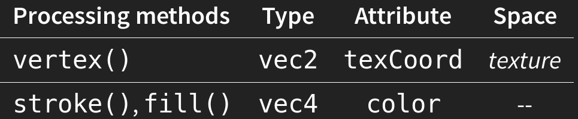
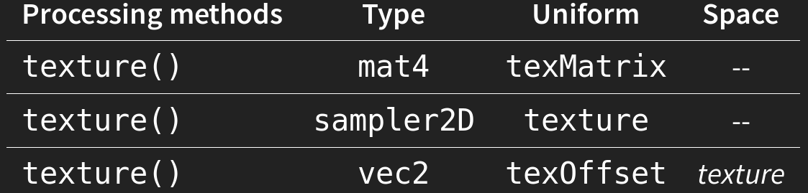
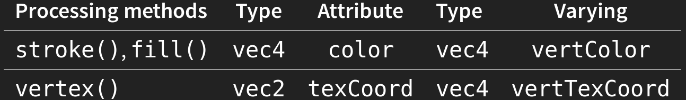
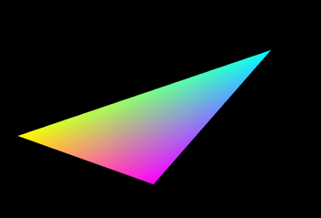
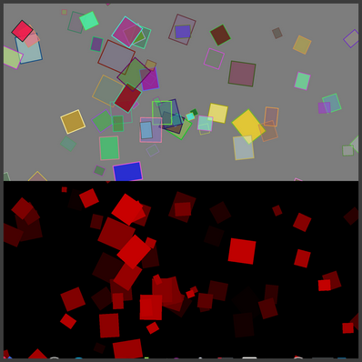

# CVI

## Clase 29/09/2020

[Presentación de la clase](https://visualcomputing.github.io/FragmentShaders/#/)

- Rasterización -> método Pineda
- Shaders GPU execution:

	- itera Vertices
		```
		for vertex in geometry:
				vertex_clipspace = vertex_shader(vertex)

		```
	- itera pixeles
		```
		for pixel in screen:
				if covered_by_geometry(pixel):
						ouptut_color = fragment_shader(pixel)

		```
- Variables:
  - Varyng: permiten relacionar un atributo de vértice con un fragmento, usando
  interpolación
  - Variables de atributo:  se definen por cada vértice, por ejemplo, la posición,
  la normal y el color

### API Shader

- LoadShader
  ```
	// Fragment shader
	loadShader(fragFilename)
	// Frangment shader, vertex
  loadShader(fragFilename, vertFilename)
  ```
	Se pueden emplear múltiples Shaders para una escena.
- Seteo de Variables uniformes: PSHADER.SET()

  ```
	.set(name, x)
  .set(name, x, y)
  .set(name, x, y, z)
  .set(name, x, y, z, w)
  .set(name, vec)	// ector
	.set(name, mat)	// Matrix
	.set(name, tex)	// Texture
  ```
	Array de variables uniformes bool[], float[], int[]. Matrices de 3 o 4
	dimensiones.

### Patrones de diseño de sombreadores de fragmentos


1. Datos enviados desde el boceto a los sombreadores: Atributos seteados por
  processing

	

	
2. Pasando datos entre sombreadores: Las variables uniformes están disponibles
  tanto para el vértice como para el sombreador de fragmentos. Las variables de
	atributo solo están disponibles para el sombreador de vértices

	
	Se refieren al pixel, no al vertice.

### Ejemplos

1. Pasar RGB a CMI:

	

	```C
	varying vec4 vertColor;
	uniform bool cmy; // Declarado por nosotros

	void main() {
		gl_FragColor = cmy ? vec4(1-vertColor.r, 1-vertColor.g, 1-vertColor.b, vertColor.a) : vertColor;
	}
	```
2. Identificar el objeto de selección:
  Buffer auxiliar

	
3. d