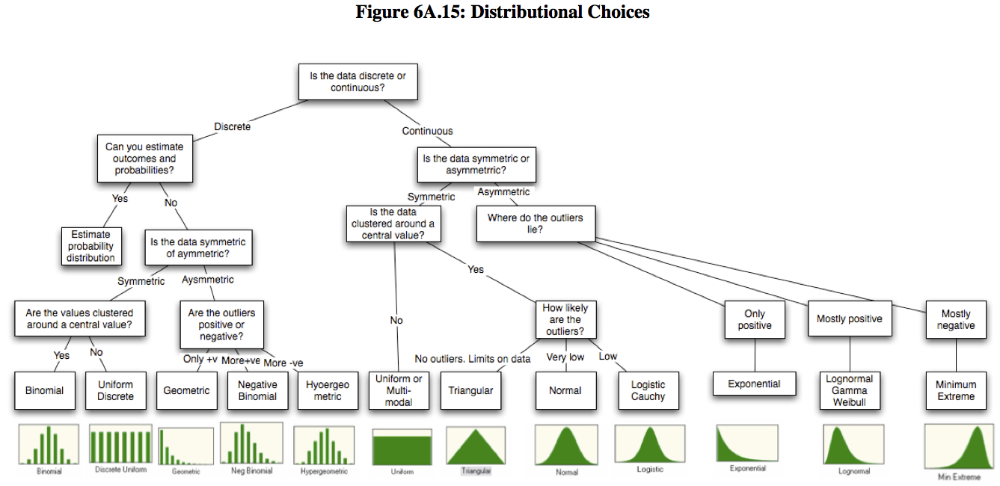

**Presentación de la clase:** [p4-basics-eda](https://felipe-calvo.github.io/r-101/p4-basics-eda.html)

## Instalamos paquetes

## Librerías utilizadas durante la clase

- [summarytools](https://github.com/dcomtois/summarytools): Es un paquete R para la exploración de datos y la creación de informes simples.
- [modeest](https://github.com/paulponcet/modeest): Proporciona estimadores del modo de datos univariados unimodales (y a veces multimodales) y valores de los modos de distribuciones de probabilidad habituales.
- [skimr](https://github.com/ropensci/skimr): Muestra estadísticas resumidas que el usuario puede hojear rápidamente para comprender sus datos.
- [ggpubr](https://github.com/kassambara/ggpubr): Proporciona algunas funciones fáciles de usar para crear y personalizar gráficos listos para publicación basados en 'ggplot2'
- [tydiverse](https://github.com/tidyverse/tidyverse): Es un conjunto de paquetes en R diseñados para ciencia de datos. Esto lo que significa es que ayuda en todo el proceso de importar transformar visualizar modelar y comunicar toda la información que normalmente utilizamos en procesos de ciencia de datos.
- [esquisse](https://dreamrs.github.io/esquisse/index.html): Este complemento le permite explorar sus datos de forma interactiva visualizándolos con el paquete ggplot2. Le permite dibujar diagramas de barras, curvas, diagramas de dispersión, histogramas, diagramas de caja y objetos sf, luego exportar el gráfico o recuperar el código para reproducir el gráfico.
- [corrplot](https://github.com/taiyun/corrplot): Es para visualizar matrices de correlación e intervalos de confianza. También contiene algunos algoritmos para reordenar matrices. 

```{r}
# Paquetes para hacer resúmenes de conjuntos de datos
# install.packages("summarytools")
# install.packages("modeest")

# Paquete para estimar la moda de un vector univariado
# install.packages("skimr")

# Paquete para hacer diversas gráficas
# install.packages("ggpubr")
```

## Importar datos

```{r}
library("tidyverse")
library("skimr")
library("summarytools")
library("modeest")
library("ggpubr")

## Lectura
read_delim(
  file = "data/Boston_Housing.txt",
  delim = "|", 
  locale=locale(decimal_mark = ",")
) -> data_raw

## Revisar la estructura de los datos
str(data_raw)
```

En R, los **factores** se usan para trabajar con variables categóricas, es decir, variables que tienen un conjunto fijo y conocido de valores posibles. También son útiles cuando quieres mostrar vectores de caracteres en un orden no alfabético.

```{r}
## Convertimos variables respectivas a factores
factores <- c("CHAS","RAD")
data_raw %>% mutate_at(factores,factor) -> data
```
## Estadísticos descriptivos frecuentes

```r
# Univariados
mean() # para la media
median() #para la mediana
modeest::mfv() # para la moda
var() # para la varianza
sd() # para la desviación estándar
max() # para el máximo
min() # para el mínimo
quantile() # para los cuantiles
IQR() # para el rango intercuartílico
# Multivariados
cov() # para la covarianza
cor() # para la correlación
table() # para tablas de contingencia - también sirve en una variable
```

### Ejemplo: estadísticos descriptivos para la variable AGE (cuantitativa)

[mean()](https://www.rdocumentation.org/packages/base/versions/3.6.2/topics/mean)
```{r}
mean(data$AGE)
```

[median()](https://www.rdocumentation.org/packages/stats/versions/3.6.2/topics/median)

```{r}
median(data$AGE)
```
[var()](https://www.rdocumentation.org/packages/cmvnorm/versions/1.0-6/topics/var)

```{r}
var(data$AGE)
```

[sd()](https://www.rdocumentation.org/packages/stats/versions/3.6.2/topics/sd)
```{r}
sd(data$AGE)
```
[max()](https://www.rdocumentation.org/packages/rapportools/versions/1.0/topics/max)

```{r}
max(data$AGE)
```

[min()](https://www.rdocumentation.org/packages/rapportools/versions/1.0/topics/min)
```{r}
min(data$AGE)
```

[quantile()](https://www.rdocumentation.org/packages/stats/versions/3.6.2/topics/quantile)

```{r}
quantile(data$AGE)
```

[IQR()](https://www.rdocumentation.org/packages/stats/versions/3.6.2/topics/IQR)
```{r}
IQR(data$AGE)
```

### Ejemplo: estadísticos descriptivos para la variable RAD (cualitativa)

Most Frequent Value(s): [mfv()](https://www.rdocumentation.org/packages/statip/versions/0.2.3/topics/mfv)
```{r}
# Moda
mfv(data$RAD)
```

[table()](https://www.rdocumentation.org/packages/base/versions/3.6.2/topics/table)
```{r}
# Frecuencias
table(data$RAD)
```

[prop.table()](https://www.rdocumentation.org/packages/base/versions/3.6.2/topics/prop.table)

Explicación de cómo funciona - [StackOverflow](https://stackoverflow.com/questions/45633699/how-does-the-prop-table-function-work-in-r)

```{r}
# Proporciones
prop.table(table(data$RAD))
```

## Un método útil integrado en R: summary()

```{r}
## Resumen para una sola variable
summary(data$AGE)
```
```{r}
## Resumen para todo el conjunto de datos
summary(data)
```
Normalmente estas funciones no trabajan si encuentran datos perdidos, para eliminar esta restricción se usa
```{r}
# Omitir datos perdidos
na.rm = TRUE

## Cálculo del promedio omitiendo datos perdidos/faltantes
mean(data$AGE, na.rm = TRUE)
```

## Otros métodos de resumen útiles

```{r}
# Resumen usando el paquete skimr
skim(data)
```

```{r}
# Resumen usando el paquete summarytools
summarytools::descr(data)
```

## Gráficas básicas



### Diagrama de puntos

Presenta los valores de una variable para cada observación usando símbolos, y cada observación se grafica de manera relativa al número de la observación.

[plot()](https://www.rdocumentation.org/packages/graphics/versions/3.6.2/topics/plot)

```{r}
plot(data$AGE)
```

### Histogramas

Es un tipo de gráfica de barras que muestra conteos o frecuencias relativas de valores que caen en diferentes intervalos.

[hist](https://www.rdocumentation.org/packages/graphics/versions/3.6.2/topics/hist)

```{r}
hist(data$AGE)
```

Podemos cambiar el número de barras usando el parámetro breaks

```{r}
hist(data$AGE, breaks=20)
```

### Gráficos de densidad (también llamados gráficas Kernel o histogramas suavizados)

Muestra las frecuencias relativas locales de los puntos a lo largo del eje X. En otras palabras, en los intervalos donde hay más puntos/observaciones la gráfica crece indicando mayor “densidad”.

```{r}
plot(density(data$AGE))
```

### Gráfico Q-Q

Se usa para revisar si los datos siguen una distribución **aproximadamente** normal.

[ggqqplot()](https://www.rdocumentation.org/packages/ggpubr/versions/0.4.0/topics/ggqqplot)

```{r}
ggqqplot(data, x = "AGE")
```

### Función de distribución empírica acumulada

Muestra la frecuencia relativa acumulada para los valores de la muestra.

[ggecdf()](https://www.rdocumentation.org/packages/ggpubr/versions/0.4.0/topics/ggecdf)

```{r}
ggecdf(data, x = "AGE")
```

### Boxplot

Muestra la ubicación, dispersión y distribución de una variable mediante la construcción de una figura en forma de caja con un conjunto de líneas (bigotes) que se extienden desde los extremos de la caja. Los bordes del cuadro se dibujan en los percentiles 25 y 75 de los datos, y una línea en el medio del cuadro marca el percentil 50.

[boxplot()](https://www.rdocumentation.org/packages/graphics/versions/3.6.2/topics/boxplot)

```{r}
boxplot(data$AGE)
```

**Nota:** en este ejemplo todas las variables de la base de datos son cuantitativas (en adelante nos referiremos a ellas como **variables contínuas**), y en estos casos los tipos de gráficos que más se usan son los histogramas y los boxplots. Si tuviésemos variables cualitativas (en adelante nos referiremos a ellas como **variables categóricas**), estas usualmente se representan mediante tablas de contingencia, diagramas de barras o diagramas de torta.

### Diagrama de barras

```{r}
# Sin orden
ggplot(data, aes(x = RAD))+
  geom_bar(stat="count")+
  theme_minimal()
```
```{r}
# Ordenado
# Función para reordenar los factores de un vector en orden decreciente
reorder_size <- function(x) {
        factor(x, levels = names(sort(table(x), decreasing = TRUE)))
}
ggplot(data, aes(x = reorder_size(RAD)))+
  geom_bar(stat="count")+
  theme_minimal()
```

## Gráficos bivariados y multivariados

### Ejemplo: diagrama de dispersión entre dos variables contínuas

```{r}
plot(data$MEDV, data$RM)
```

### Ejemplo: boxplot por grupos (una variable contínua y una categórica)

```{r}
ggboxplot(data, x = "CHAS", y = "MEDV",
          palette = c("#00AFBB", "#E7B800"))
```
### Ejemplo: matríz de correlación gráfica

```{r fig4, out.width = '100%'}
library("corrplot")
data_raw %>% 
  cor %>% 
  corrplot.mixed(lower = "number", upper = "color", lower.col = "#aaaaaa", number.cex = 0.6, tl.cex = 0.6)
```

## Una librería útil con una interfaz para hacer gráficas: esquisse

```{r eval=FALSE}
## Instalamos la librería
# install.packages("esquisse")

## Cargamos la librería
library("esquisse")

## Llamamos a la función esquisser especificando con cuales datos queremos trabajar
esquisser(data = data, viewer = "browser")
```
## Gráficos profesionales

- [Galería de gráficas en R](https://www.r-graph-gallery.com/)
- [Top 50 de visualizaciones en R](http://r-statistics.co/Top50-Ggplot2-Visualizations-MasterList-R-Code.html)