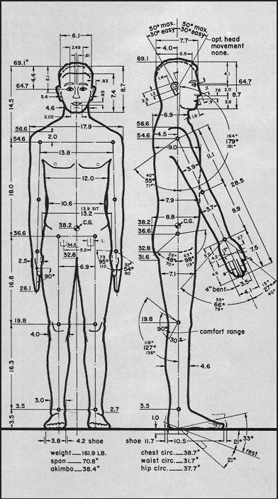
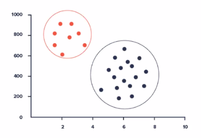
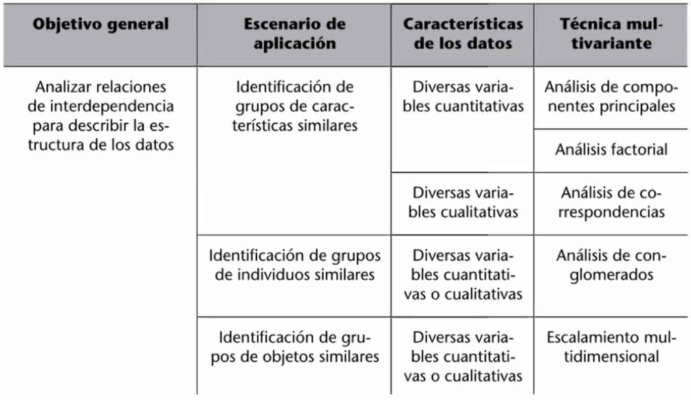
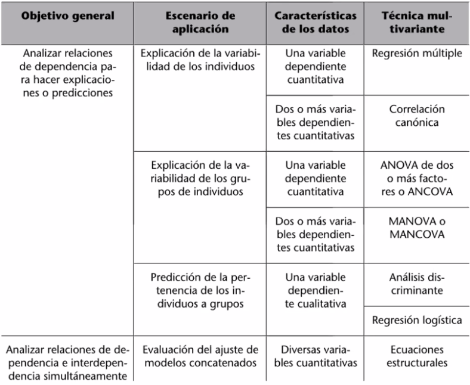

## Objetivos

1. Resumir el conjunto de variables en pocas nuevas variables, construidas como transformaciones de las originales, con la mínima perdida de información.
2. Encontrar grupos en los datos si existen.
3. Clasificar nuevas observaciones en grupos definidos.
4. Relacionar dos conjuntos de variables.

### Ejemplo 1

Se resume la cantidad total de medidas del cuerpo humano en 5 varibles:
- Altura
- Peso
- Talla de camiseta
- Talla de pantalón
- Talla de calzado



### Ejemplo 2

| Variables Originales | Nueva variable |
| :---: | :---: |
|  Ubicación geográfica <br> Estrato <br> Vivienda digna <br> Servicios públicos a los que tiene acceso <br>  Infraestructura y aparato estatal que lo rodea | Puntaje SISBEN |

## Ventajas de usar una cantidad suficiente de varibles informativas
- Es más fácil de manejar
- Es más fácil de interpretar
- Es más fácil de comparar

## Encontrar similitudes y armar grupos es muy útil

- Todos somos únicos e irrepetibles
- Hay patrones


### Ejemplos de agrupaciones de datos

- **Administración de empresas:** Construir tipologías de clientes.
- **Agricultura:** Clasificar terrenos de cultivo por fotos aéreas.
- **Ciencias de la computación:** Diseñar algoritmos de clasificación automática.
- **Ciencias del medio ambiente:** Investigar las dimensiones de la contaminación ambiental.
- **Economía:** Identificar las dimensiones del desarrollo económico.
- **Geología:** Clasificar sedimentos.
- **Ingeniería:** Transmitir óptimamente señales por canales digitales.
- **Medicina:** Clasificar tumores mediante imágenes digitales.
- **Sociología y Ciencia Política:** Construir tipologías de los votantes de un partido.





## Algunas consideraciones del análisis multivariado

- Como hemos visto el modelado estadístico es matricial.
- Cada fila en las matrices de datos es una **variables aleatoria**, y por tanto, cada una tiene una distribución de probabilidad asociada.
- Detrás hay bastante cálculo, algebra lineal y geometría.
- **¡También hay supuestos!**

## Instalar librerías

```{r}
# install.packages("Amelia") #Visualización datos perdidos
# install.packages("mvnmle")
# install.packages("BaylorEdPsych")
# install.packages("reshape2") # Transformaciones entre objetos
# install.packages("FactoMineR") # Análisis factorial
# install.packages("factoextra")
# install.packages("corrplot")
```

## Librerías utilizadas durante la clase:
- [readxl](https://github.com/tidyverse/readxl): Facilita la extracción de datos de Excel y los lleva a R, no tiene dependencias externas, por lo que es fácil de instalar y usar en todos los sistemas operativos. 
- [tydiverse](https://github.com/tidyverse/tidyverse): Es un conjunto de paquetes en R diseñados para ciencia de datos. Esto lo que significa es que ayuda en todo el proceso de importar transformar visualizar modelar y comunicar toda la información que normalmente utilizamos en procesos de ciencia de datos.
- [Amelia](https://github.com/cran/Amelia): Es un paquete R para la imputación múltiple de datos incompletos multivariados. Utiliza un algoritmo que combina bootstrapping y el algoritmo EM para tomar extracciones de la parte posterior de los datos faltantes. El paquete Amelia incluye transformaciones de normalización, a priori a nivel de celda y métodos para manejar datos transversales de series de tiempo.
- [mvnmle](https://mran.microsoft.com/snapshot/2017-04-22/web/packages/mvnmle/mvnmle.pdf): Encuentra la estimación de máxima verosimilitud del vector medio y la matriz de varianza-covarianza para datos normales multivariados con valores perdidos. - [Instalación](https://cran.r-project.org/src/contrib/Archive/mvnmle/)
- **BaylorEdPsych:** Funciones y datos R para los cursos cuantitativos del Departamento de Psicología Educativa de la Universidad de Baylor - [Instalación](https://cran.r-project.org/src/contrib/Archive/BaylorEdPsych/)
- [car](https://www.rdocumentation.org/packages/car/versions/1.2-16):  El paquete contiene principalmente funciones para regresión aplicada, modelos lineales y modelos lineales generalizados, con énfasis en el diagnóstico de regresión, en particular los métodos de diagnóstico gráfico.
- [ggplot2](https://github.com/tidyverse/ggplot2): Es un sistema para crear gráficos de forma declarativa, basado en The Grammar of Graphics.
- [GGally](https://github.com/cran/GGally): Extiende ggplot2 agregando varias funciones para reducir la complejidad de combinar geoms con datos transformados.
- [reshape2](https://github.com/cran/reshape2): Paquete de remodelación de datos.
- [FactoMineR](http://factominer.free.fr/index.html): Es un paquete R dedicado al análisis de datos exploratorios multivariante.
- [factoextra](): Facilita la extracción y visualización del resultado de análisis de datos multivariados exploratorios, que incluyen:
  - Análisis de componentes principales.
  - Análisis de correspondencia.
  - Análisis de correspondencia múltiple.
  - Análisis de factores múltiples.
  - Análisis jerárquico de factores múltiples.
  - Análisis factorial de datos mixtos.
- [corroplot](https://github.com/taiyun/corrplot): Es para visualizar matrices de correlación e intervalos de confianza. También contiene algunos algoritmos para reordenar matrices.

## Cargar librerías

```{r}
library("readxl")
library("tidyverse")
library("Amelia")
library("mvnmle")
library("BaylorEdPsych")
library("car")
library("ggplot2")
library("GGally")
library("reshape2")
library("FactoMineR")
library("factoextra")
library("corrplot")
```
## Importar datos

```{r}
read_xlsx(
  path = "data/Boston_Housing.xlsx", 
  sheet="Data"
) -> boston

## Revisar la estructura inicial de los datos
str(boston)
```

```{r}
## Convierto variables respectivas a factores
factores <- c("CHAS")
boston %>% mutate_at(factores,factor) -> data

## Revisar la estructura actualizada de los datos
str(data)
```
```{r}
## Le decimos a R que vamos a trabajar con esos datos y se los ponemos "en primer plano"
attach(data)

## Veamos los primeros registros
head(data)
```

## Información sobre el conjunto de datos

### Información general

Los datos de la vivienda contienen 506 secciones censales de Boston del censo de 1970. La base de datos Boston Housing contiene los datos originales de Harrison y Rubinfeld (1979).

#### Variables

- **CRIM:** crimen per cápita por ciudad
- **ZN:** proporción de terrenos residenciales divididos en zonas para lotes de más de 25,000 pies cuadrados
- **INDUS:** proporción de acres de negocios no minoristas por ciudad
- **CHAS:** variable dummy de Charles River (= 1 si el limita con el río, 0 de lo contrario)
- **NOX:** concentración de óxidos nítricos (partes por 10 millones)
- **RM:** número promedio de habitaciones por vivienda
- **AGE:** proporción de unidades ocupadas por sus propietarios construidas antes de 1940
- **DIS:** distancias ponderadas a cinco centros de empleo de Boston
- **RAD:** índice de accesibilidad a las autopistas radiales
- **TAX:** tasa de impuesto a la propiedad de valor completo por USD 10,000
- **PTRATIO:** proporción de estudiantes por profesor
- **B:** 1000*(Bk - 0,63)^ 2, donde Bk es la proporción de negros por ciudad
- **LSTAT:** porcentaje de población clase baja (menores ingresos)
- **MEDV:** valor mediano de las viviendas ocupadas por sus propietarios (en miles de dólares). Esta es la variable objetivo.

#### Fuente

Harrison, D. and Rubinfeld, D.L. (1978). Hedonic prices and the demand for clean air. Journal of Environmental Economics and Management, 5, 81–102.

## Dimensionalidad de los datos

```{r}
dim(data)
```
## Limpieza de datos

### Datos faltantes

Vamos a comprobar datos faltantes sumando NA por columna (es decir, para cada variable) y además los graficaremos mediante el método **missmap()** de la librería Amelia.

```{r}
## Conteo de datos faltantes por variable
data %>% map_df(is.na) %>% colSums()
```

```{r, out.width = '90%'}
## Gráfica de datos faltantes
missmap(data, 
        col=c('yellow','pink'),
        main='Mapa de valores perdidos',
        y.at=1,
        y.labels='',
        legend=TRUE)
```

En este caso no hay datos perdidos. Sin embargo, en muchos casos de la vida real es posible que nos falten datos. Si son pocos los faltantes los podemos imputarlos, si son muchos surgen dos escenarios:

- Que los datos faltantes sean aleatorios. En esos casos se podrían correr métodos de imputación múltiple (p.e. MICE).
- Que hayan patrones de pérdida de datos, lo que puede indicar un problema en la recolección, captura y distribución de la base de datos.

### Datos atípicos

Para detectar datos atípicos podemos seguir dos caminos:

- Buscar datos atípicos para cada variable (columna). Para esto podríamos usar boxplots.
- Buscar filas que consistentemente tengan datos atípicos en todas las celdas.

Dado que el camino de revisar cada variable ya sabemos cómo hacerlo, miremos el segundo camino que es propio del análisis multivariado.

Para esto vamos a definir la **distancia de Cook**: dado un modelo de regresión, se calcula la influencia ejercida por cada fila en el resultado previsto y el interés es detectar filas cuyos resultados observados sean muy distintos a los resultados predichos.

```{r}
modelo.regresion <- lm(MEDV ~ ., data=data)
cooksd <- cooks.distance(modelo.regresion)
```
En ese sentido, diremos que tendremos una fila que representa una onservación atípica si el valor observado es superior a 4 veces el promedio (no es un límite estricto).

```{r, out.width = '90%'}
# Gráfica de la distancia de Cook
plot(cooksd, pch="*", cex=2, main="Observaciones Atípicas por distancia de Cook") 
# Superponemos el límite definido
abline(h = 4*mean(cooksd, na.rm=T), col="red")  
# Agregamos etiquetas de identificación para observaciones atípicas
text(x=1:length(cooksd)+1, y=cooksd, labels=ifelse(cooksd>4*mean(cooksd, na.rm=T),names(cooksd),""), col="red") 
```

```{r}
## Número de filas a revisar
atipicas <- which((cooksd>4*mean(cooksd, na.rm=T)) == "TRUE")
atipicas
```

Esta revisión de filas depende del problema en estudio. En este caso, es posible que existan viviendas demasiado costosas cuyo precio esté influenciado por otras variables.

Además, hay que tener en cuenta que estos datos corresponden a un **censo** y en los censos puede haber numerosos casos excepcionales.

La revisión y las decisiones que tome el analista cambiarían sustancialmente si los datos en cambio provinieran de una **muestra probabilística**, en las cuales los datos atípicos son menos frecuentes.

## Análisis descriptivo

```{r}
## Resumen básico de datos
summary(data)
```
```{r, out.width = '90%'}
## Resumen gráfico
## Usamos el método para graficar histogramas
## Seleccionamos como objetivo la variable quality
ggplot(data, aes(MEDV)) +
    geom_histogram()
```

```{r, out.width = '100%'}
## Correlogramas
ggcorr(
  data, 
  method = c("everything", "spearman"),
  size = 3
  )
```
```{r, out.width = '100%'}
ggpairs(
  data, 
  title="Correlograma",
  axisLabels = "none",
  upper = list(continuous = wrap("cor", size = 2))
  )
```

Dado que tenemos numerosas variables altamente correlacionadas con nuestra variable de respuesta, podemos hacer un filtro más fuerte y descartar aquellas que tengan una correlación menor a 0.35 en valor absoluto. En ese orden de ideas descartaremos las variables **DIS** y **B**.

### Efecto de las variables

```{r, out.width = '100%'}
data %>%
  select(c(CRIM, ZN, INDUS, NOX, RM, AGE, RAD, TAX, PTRATIO, LSTAT, MEDV)) %>%
  melt(id.vars = "MEDV") %>%
  ggplot(aes(x = value, y = MEDV, colour = variable)) +
  geom_point(alpha = 0.7) +
  stat_smooth(aes(colour = "black")) +
  facet_wrap(~variable, scales = "free", ncol = 2) +
  labs(x = "Valores de la variables", y = "Valor mediano de las viviendas") +
  theme_minimal()
```
## Ajuste de un modelo de regresión múltiple

```{r}
modelo <- lm(MEDV ~ CRIM + ZN + INDUS + NOX + RM + AGE + RAD + TAX + PTRATIO + LSTAT, data = data)

## Resumen del modelo
summary(modelo)
```
```{r, out.width = '100%'}
## Validación del modelo
plot(modelo)
```
## Ajuste de un análisis de componentes principales

```{r}
## Declaro un vector con las variables que quiero agrupar
var_interes = c("CRIM", "ZN", "INDUS", "NOX", "RM", "AGE", "RAD", "TAX", "PTRATIO", "LSTAT")

## Y estandarizo esas variables
data %>%
  select(var_interes) %>%
  mutate_all(scale) -> data_estandarizada
```
```{r, out.width = '100%'}
## Ajusto componentes principales usando el método PCA()
acp = PCA(data_estandarizada,graph=F)

## Círculo de correlaciones entre variables
fviz_pca_var(acp, col.var = "black", title="Círculo de correlaciones")
```
```{r}
## Componentes principales
eig.val <- get_eigenvalue(acp)
eig.val
```
Cuando el valor propio (eigenvalue) de un componente es superior a 1 se suele retener, es decir, la combinación de variables al interior de un “componente” es capaz de explicar más varianza que cada variable por separado.

```{r, out.width = '90%'}
## Gráfico de valores propios (eigenvalue)
fviz_eig(acp, addlabels = TRUE, ylim = c(0, 70))
```
```{r, out.width = '90%'}
## Extraigo las variables del análisis
var <- get_pca_var(acp)

## Carga de las variables
corrplot(var$cos2, is.corr=FALSE)
```
Podemos reducir la dimensión del conjunto de datos de 10 variables de interés a 3 nuevas variables llamadas **componentes principales**. Incluso podríamos quedarnos con dos componentes principales según el criterio gráfico del codo.

### Construccion de las nuevas variables

Asumamos que nos vamos a quedar con 2 componentes principales. En la práctica, eso implica que debemos agregar dos nuevas variables a nuestra base de datos:

- Componente 1
- Componente 2

¿Cómo calcular los valores que irían en las celdas?

El análisis por componentes principales nos genera nuevas variables que son una **combinación lineal** de las variables originales.
```{r}
## Extraemos las cargas de cada variable en cada componente
cargas = sweep(acp$var$coord,2,sqrt(acp$eig[1:ncol(acp$var$coord),1]),FUN="/")
cargas
```

```{r}
## Veamos solo las cargas del primer componente
cargas[,1]
```
```{r}
## Veamos solo las cargas del primer componente
cargas[,1]
```
Con estos valores podemos calcular el valor del primer componente por medio de una combinación lineal de las variables originales:

```{r, eval=F}
0.27*CRIM - 0.26*ZN + 0.37*INDUS + 0.35*NOX - 0.22*RM + 0.32*AGE + 0.34*RAD + 0.36*TAX + 0.23*PTRATIO + 0.34*LSTAT
```

De igual manera procedemos con el segundo componente:
```{r}
cargas[,2]
```
```{r, eval=F}
0.42*CRIM + 0.43*ZN - 0.07*INDUS - 0.04*NOX + 0.44*RM - 0.20*AGE + 0.44*RAD + 0.36*TAX - 0.02*PTRATIO - 0.22*LSTAT
```

Ya sabemos las ecuaciones de nuestros componentes, ahora los vamos a agregar a nuestra base de datos:

```{r}
## Definimos una función para hacer la multiplicación
## De cada variable en los datos estandarizados por su respectivo "ponderador"
calcpc <- function(variables,loadings)
{
  # Número de observaciones en el conjunto de datos
  as.data.frame(variables)
  numsamples <- nrow(variables)
  # Creamos un vector para alojar el componente
  pc <- numeric(numsamples)
  # Número de variables en el conjunto de datos
  numvariables <- length(variables)
  # Calculo del valor del componente para cada observacion
  for (i in 1:numsamples)
  {
    valuei <- 0
    for (j in 1:numvariables)
    {
      valueij <- variables[i,j]
      loadingj <- loadings[j]
      valuei <- valuei + (valueij * loadingj)
    }
    pc[i] <- valuei
  }
  return(unlist(pc))
}

## Cálculo del primer componente
comp1 = calcpc(data_estandarizada, cargas[,1])

## Cálculo del segundo componente
comp2 = calcpc(data_estandarizada, cargas[,2])

## Agregamos los componentes a la base de datos
data %>% 
  add_column(comp1 = comp1, comp2 = comp2) -> data_con_componentes

## Podemos crear una versión reducida de nuestro conjunto de datos
data_con_componentes %>%
  select(comp1, comp2, MEDV) -> data_reducida

## Variación en la dimensionalidad de los datos
dim(data)
```
```{r}
dim(data_estandarizada)
```
```{r}
dim(data_con_componentes)
```
```{r}
dim(data_reducida)
```
## Observación de cierre

Todo el análisis multivariado realizado hasta el momento se ha enfocado en entender el comportamiento de las **variables (columnas)**. Siguiendo los mismos principios y herramientas de análisis, podríamos enfocarnos también en las **observaciones (filas)** e igualmente buscar similitudes, diferencias y grupos de individuos.