# Módulo 3 - Acondicionamiento físico

- **Profesora:** Angela Consuelo Latorre Guapo
- **Fecha de Inicio:** 14 de Octubre de 2020
- **Fecha de Culminación:** 28 de Octubre de 2020

## Clase 14 de Octubre de 2020

Cómo es tu estilo de vida (FANTASTICO):

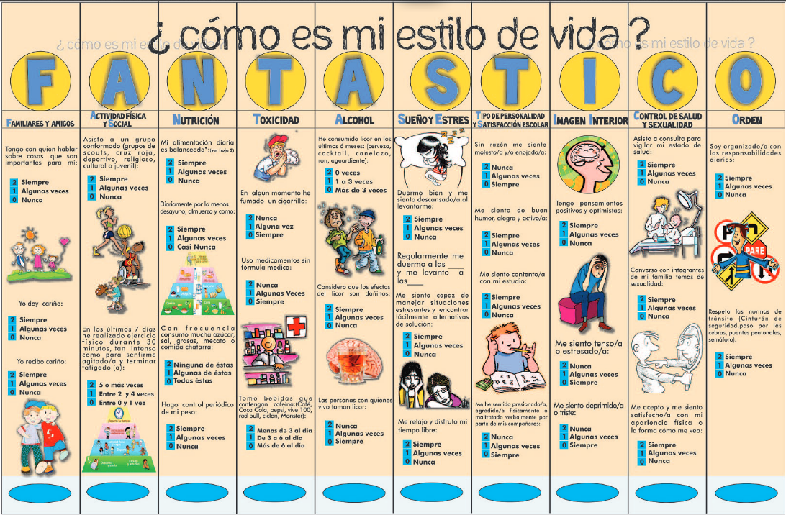

- **F:** Familiar = 5
  - Tengo con quien hablar sobre cosas que son importantes para mí: siempre - 2
  - Yo doy cariño: algunas veces - 1
  - Recibo cariño: Siempre - 2
- **A:** Actividad física y entorno social = 0
  - Asisto a un grupo conformado: Nunca - 0
  - En los últimos 7 días he realizado ejercicio (antes de la electiva): 0 - Nunca
- **N:** Nutrición = 6
  - Mi alimentación diaria es balanceada: algunas veces - 1
  - 3 comidas: 2 siempre
  - Comida chatarra: 1 algunas veces
  - Hago control periódico de mi peso: Siempre - 2
- **T:** Toxicidad = 6
  - He fumado: 2 Nunca
  - Medicamento sin formula médica: Nunca - 2
  - Bebidas con Cafeina: 2
- **S:** Consumo Alcohol = 4
  - Haz consumido alcohol en los últimos 6 meses: 1
  - Considero los efectos del licor es negativo: siempre 2
  - Las personas con las que vivo beben: algunas veces - 1
- **A:** Sueño y estrés = 3
  - Duermo bien y me siento descansado al evantarme: Algunas veces - 1
  - Manejo situaciones estresantes y encontrar soluciones: Algunas veces - 1
  - Tiempo libre: Algunas veces - 1
- **T:** Académico = 3
  - Sin razón me siento molesto y enojado: Algunas veces - 1
  - Feliz y activo: Algunas veces - 1
  - Me siento contento con mi estudio: Algunas veces - 1
  - Me he sentido presionado o agredido por mi compañeros: algunas veces - 1
- **I:** Imagen Interior: 6
  - Pensamientos positivos: siempre - 2
  - Me siento tenso o estresado: nunca 2
  - Me siento deprimido: nunca - 2
- **C:** Salud y Sexualidad = 1
  - Asisto a consulta para vigilar mi estado de salud: Nunca - 0
  - Converso con mi familia temas de sexualidad: Nunca - 0
  - Me siento satisfecho con mi apariencia: Algunas Veces - 1
- **O:** Orden = 3
	- Soy organizado y responsable: Siempre - 2
	- Respeto las normas de transito: Algunas veces - 1

Resultado:

$$
Total \cdot 2 = 32 \cdot 2 = 74
$$

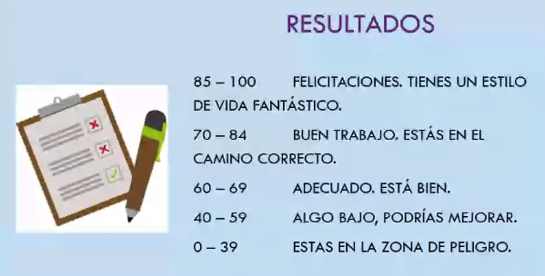

Sedentarismo es uno de los principales factores de padecer enfermedades no
transmisibles: Diabetes, Cardiopatías, Hipertensión, Osteoporosis, Obesidad,
Cáncer.

El Sedentarismo produce disfunciones: Estreñimiento, Várices, Propensión
inflamación organos abdominales, Sensación de fatiga. Es importante romper con el
comportamiento sedentario, no es suficiente con la actividad física.

El sendentarismo aumenta niveles de riesgo psicosociales: Ansiedad, depresión,
Aumento de Estrés, Aislamiento Social, Agresividad, Irrativilidad, Astenia,
Adinamia.

**Actividad física:** Cualquier movimiento corporal voluntario de contracción
muscular con gasto energético mayor al de reposo; entendida como un comportamiento
humano complejo, voluntario y que produce un conjunto de beneficios para la salud,
la cual puede ser realizada practicando un deporte, caminando, bailando, o
realizando actividades recreativas o habituales que impliqued moverse.

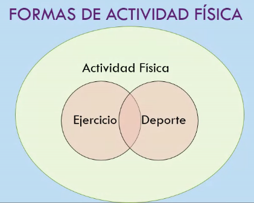

- **Ejercicio:** Actividad física planificada, estructurada y organizada con un
	objetivo particular.
- **Deporte:** Actividad física pero en competencia con reglas, el deporte puede
  ser recreativo o formal.

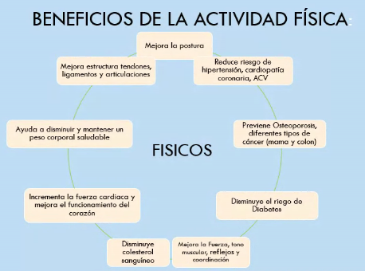

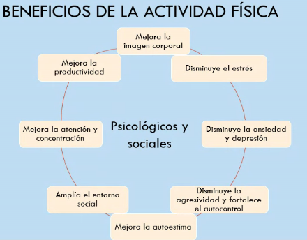

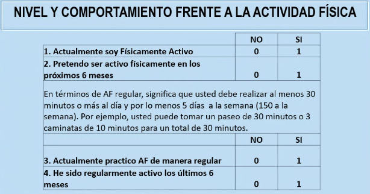

| Preguta | Respuesta |
| :---: | :---: |
| 1 | 1 |
| 2 | 1 |
| 3 | 0 |
| 4 | 0 |

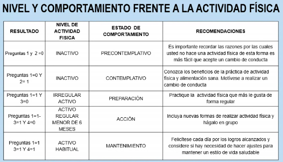

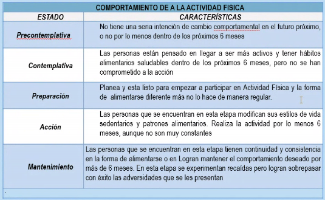

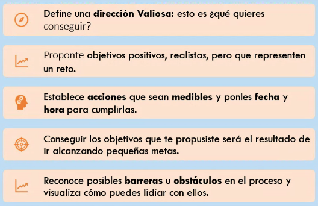

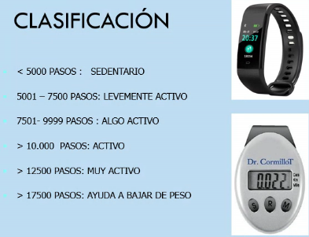

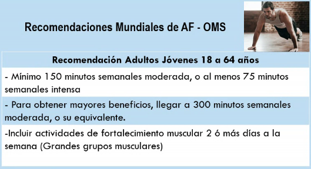

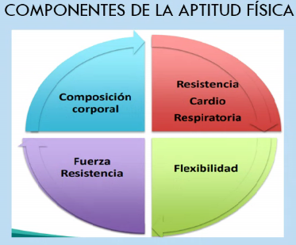