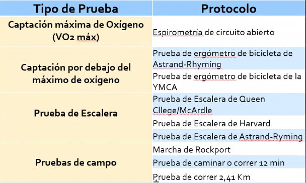

# Módulo 3 - Acondicionamiento físico

- **Profesora:** Angela Consuelo Latorre Guapo
- **Fecha de Inicio:** 14 de Octubre de 2020
- **Fecha de Culminación:** 28 de Octubre de 2020

## FANTASTICO

Cómo es tu estilo de vida (FANTASTICO):

- **F:** Familiar = 5
  - Tengo con quien hablar sobre cosas que son importantes para mí: siempre - 2
  - Yo doy cariño: algunas veces - 1
  - Recibo cariño: Siempre - 2
- **A:** Actividad física y entorno social = 0
  - Asisto a un grupo conformado: Nunca - 0
  - En los últimos 7 días he realizado ejercicio (antes de la electiva): 0 - Nunca
- **N:** Nutrición = 6
  - Mi alimentación diaria es balanceada: algunas veces - 1
  - 3 comidas: 2 siempre
  - Comida chatarra: 1 algunas veces
  - Hago control periódico de mi peso: Siempre - 2
- **T:** Toxicidad = 6
  - He fumado: 2 Nunca
  - Medicamento sin formula médica: Nunca - 2
  - Bebidas con Cafeina: 2
- **S:** Consumo Alcohol = 4
  - Haz consumido alcohol en los últimos 6 meses: 1
  - Considero los efectos del licor es negativo: siempre 2
  - Las personas con las que vivo beben: algunas veces - 1
- **A:** Sueño y estrés = 3
  - Duermo bien y me siento descansado al evantarme: Algunas veces - 1
  - Manejo situaciones estresantes y encontrar soluciones: Algunas veces - 1
  - Tiempo libre: Algunas veces - 1
- **T:** Académico = 3
  - Sin razón me siento molesto y enojado: Algunas veces - 1
  - Feliz y activo: Algunas veces - 1
  - Me siento contento con mi estudio: Algunas veces - 1
  - Me he sentido presionado o agredido por mi compañeros: algunas veces - 1
- **I:** Imagen Interior: 6
  - Pensamientos positivos: siempre - 2
  - Me siento tenso o estresado: nunca 2
  - Me siento deprimido: nunca - 2
- **C:** Salud y Sexualidad = 1
  - Asisto a consulta para vigilar mi estado de salud: Nunca - 0
  - Converso con mi familia temas de sexualidad: Nunca - 0
  - Me siento satisfecho con mi apariencia: Algunas Veces - 1
- **O:** Orden = 3
	- Soy organizado y responsable: Siempre - 2
	- Respeto las normas de transito: Algunas veces - 1

Resultado:

$$
Total \cdot 2 = 32 \cdot 2 = 74
$$

Sedentarismo es uno de los principales factores de padecer enfermedades no
transmisibles: Diabetes, Cardiopatías, Hipertensión, Osteoporosis, Obesidad,
Cáncer.

El Sedentarismo produce disfunciones: Estreñimiento, Várices, Propensión
inflamación organos abdominales, Sensación de fatiga. Es importante romper con el
comportamiento sedentario, no es suficiente con la actividad física.

El sendentarismo aumenta niveles de riesgo psicosociales: Ansiedad, depresión,
Aumento de Estrés, Aislamiento Social, Agresividad, Irrativilidad, Astenia,
Adinamia.

**Actividad física:** Cualquier movimiento corporal voluntario de contracción
muscular con gasto energético mayor al de reposo; entendida como un comportamiento
humano complejo, voluntario y que produce un conjunto de beneficios para la salud,
la cual puede ser realizada practicando un deporte, caminando, bailando, o
realizando actividades recreativas o habituales que impliqued moverse.

- **Ejercicio:** Actividad física planificada, estructurada y organizada con un
	objetivo particular.
- **Deporte:** Actividad física pero en competencia con reglas, el deporte puede
  ser recreativo o formal.

| Preguta | Respuesta |
| :---: | :---: |
| 1 | 1 |
| 2 | 1 |
| 3 | 0 |
| 4 | 0 |

## Componentes de la Aptitud física

1. **Composición corporal:** porcentaje de grasa, músculo, hueso del cuerpo
	- permite de riesgos de salud
	- Identificar enfermedades relacionadas con la obesidad

	**Mediciones:** Estas permiten conocer la composición corporal y planificar el
	ejercicio
	- La relación entre el peso y la talla es el índice de masa corporal.
	- Circunferencia de la cintura
		| Sexo	|	Riesgo	|
		|	:---:	|	:---:	|
		|	Mujeres	| > 88 cm	|
		| Hombres	|	> 102 cm	|
	- Medición del porcentaje de grasa
  		- Medición pliegues cutáneos
  		- Impedancia Bioeléctrica
2. **Fuerza muscular**

  - Importancia:
   	- Mejora la composición de los tejidos conectivos
   	- Mejora la densidad ósea
   	- Aumenta el gasto calórico
   	- Mejora la respuesta cardiovascular
   	- Mejora el desempeño en actividades diarias
   	- Mejora postura y previene lesiones

  - Tipos de Fuerza Muscular:

   	- Clasificación por **Contracción muscular**
     	- **Fuerza estática:** Se genera cuando hay una contracción isométrica. Se
  			contrae pero no genera movimiento de la articulación en la que está
				ubicado.
     	- **Fuerza dinámica:** Se genera cuando hay una contracción isotónica.
  			Genera movimiento de la articulación.
         	- **Concéntrica:** los extremos se acortan generando tensión y
						contracción.
         	- **Excéntrica:** Los extremos se alejan generando tensión y contracción.
   	- Clasificación por **Movilización de las cargas**
     	- **Fuerza Máxima:** Capacidad dels istema neuromuscular de realizar la
  			contracción voluntaria máxima, es decir, el peso máximo que una persona es
				capaz de desplazar en un movimiento. Se evalúa de diferentes formas:
         	- **Directa:** aparatos (dinamómetros), fuerza máxima estática.
         	- **RM:** Movimiento o peso máximo que se puede movilizar, se pueden
						obtener por medio de test. Peso máximo 10 repeticiones.
              - Test directo: Se pone un peso suficiente a una persona y se
                registra.
              - Test	indirecto: Peso menor pero suficiente (menos de 10
                repeticiones), luego se utiliza la fórmula:

                $1 RM = \frac{Kg}{[1.0278 - (0.0278 \cdot N. Rep)]}$
     	- **Fuerza explosiva o de velocidad:** Es la magnitud de fuerza interna que
  			el sistema neuromuscular puede desarrollar por unidad de tiempo. También
				denominada potencia. Evaluación:
         	- Test de salto vertical
         	- Test de saltos sucesivos
         	- Test de lanzamientos de Balón medicinal
         	- Test de lanzamiento de una mano
     	- **Fuerza de resistencia:** Capacidad de sostener la fuerza frente a cargas
        relativamentes prolongadas, sin aparición de fatiga. Evaluación (mayor
        cantidad de movimientos en un tiempo determinado):
       	- Test de flexo-extensiones de pierna
       	- Test de flexión de brazos en barras
3. **Flexibilidad:** Capacidad de usar los músculos y articulaciones en toda la
  amplitud del movimiento.

	Importancia
	- Mejora sistema articular
	- Disminución del estrés
	- Mejora simetría corporal.
	- Prevensión de lesiones y dolor en zona lumbar

	Tipos
	- Estática: Rango máximo de estiramiento con ayuda de una fuerza externa
	- Dinámica: Rango máximo de una articulación sin ayuda de una fuerza externa.

	Evaluación:
	- Gionometría: Angulo que se alcanza
	- Test específicos:
		- Wells o Seat and Reach
		- Pectorales
		- Aductores de cadera

4. **Resistencia Cardiovascular:** Capacidad de sostener un esfuerzo en función
  del tiempo. Requiere de la integración de muchas funciones fisiológicas, cuyo
	objetivo es el mantenimiento de la contracción muscular.

	Importancia:
	- Disminución de factores de riesgo

	Tipos:
	- Resistencia Aeróbica: Se da cuando se realiza un esfuerzo de larga duración e
    intensidad moderada. Se realiza manteniendo un equilibrio entre el aporte de
    oxigeno y su consumo.
	- Resistencia Anaeróbica: Se da en esfuerzos de mayor intensidad y menor
    duración. La cantidad de oxígeno que el cuerpo necesita consumir es superior a
    la que puede aportar.

	Pruebas

	

## Entrenamiento de Cualidades físicas

### Principios de Entrenamiento

Normas qe guían el desarrollo del entrenamiento, para lograr los objetivos
planteados y los procesos de adaptación.

1. **Sobrecarga:** Es necesario someter el cuerpo a ejercicios de intensidad y
  duración superiores de los que soporta normalmente. Aproximadamente cada 6-8
  semanas modificar la carga
2. **Progresión:** Es necesario somenter el cuerpo a cargas cada vez mayores a lo
  largo del entrenamiento para lograr adaptaciones. Las cargas se deben aumentar
  modificando el volumen e instensidad de los ejercicios
3. **Recuperación:** Es necesario un periodo de descanso entre estímulos para
  lograr el equilibrio, adaptarse y obtener máximos beneficios del entrenamiento.
4. **Reversibilidad:** Los beneficios obtenidos en un programa de entrenamiento se
  perderán si el entrenamiento se reduce o suspende completamente.
5. **Especificidad:** El entrenamiento debe estar alineado con las características
  del deporte o la actividad que se practica.
6. **Individualidad:** Las cargas de entrenamiento deben adaptarse a las
  características específicas de cada persona.
7. **Periodización:** Implica la planificación del programa de entrenamiento a
  intervalos regulares según el calendario de competencias.
8. **Variación de la carga:** No acostumbrarse a una misma carga ni a los
  ejercicios.

# Entrenamiento de cualidades físicas

## Fuerza

Parámetros:
- **Peso o carga:** Peso adicional al peso corporal con el que se trabajará cada
  movimiento.
- **Repeticiones:** Número de veces seguidas que se realiza el ejercicio hasta el
  descanso.
- **Series:** Conjunto de repeticiones previas a cada descanso.
- **Recuperación:** Tiempo de descanso entre serie y serie.
- **RM - Repetición máxima:** Peso máximo que se puede mover en cada ejercicio.
- **%RM:** Peso que se determina para hacer ejercicio.

La variación de los parámetros depende del objetivo (potencia, resistencia o
hipertrofia).

Tipos de series:
- **Superseries:** 2 ejercicios distintos sin descanso.
- **Piramidales:**
  - **Ascendentes:** Se aumenta el peso pero se reduce el número de repeticiones.
  - **Descendentes:** Menos repeticiones y más peso y va aumentando las
    repeticiones y reduciendo el peso
- **Biseries y triseries:** Secuencias de diferentes ejercicios que trabajen el
  mismo grupo muscular y sin descanso entre ellos.
- **Circuito:**

Entrenamiento de la fuerza

| Item  | Fuerza Máxima | Fuerza Explosiva  | Fuerza de Resistencia |
| :---: | :---: | :---: | :---: |
| Peso  | Máximo (75% - 100 % RM) | Mínimo  (20% - 50% RM) | Medio (50% - 70% RM) |
| Repeticiones  | Pocas (1-12)  | Pocas pero rápidas (6-10) | Muchas (15-20)  |
| Recuperación  | Larga (2'-3') |  Larga (2' - 3') | Corta (30'' - 1'30')  |
| Ejemplos  | 3 Ser x 5 Rep al 80%   4 Ser x 3 Rep al 90%  | 4 Ser x 6 Rep al 40%   3 Ser x 10 Rep al 50% | 3 Ser x 15 Rep al 50%   3 Circuitos de 6 ejercicios x 20 repeticiones al 60% |
| Características   | Se entrena a partir de 16-18 años en alto rendimiento. No se debe trabajar sin una gran base de trabajo previo. | Específica en ciertos deportes y acciones concretas del juego | La más relacionada con la salud. Es la OPCIÓN RECOMENDABLE para empezar, mantenerse o tonificar a nivel general.  |

Métodos para entrenar la fuerza de resistencia, para variabilidad:
- Autocarga
- Sobrecarga
- Entrenamiento con pareja
- Entrenamiento en series
- Intervalos
- Circuito

## Resistencia Cardiovascular

Frecuencias Cardiaca Máxima

| Fórmulas  | Origen  |
| :---: | :---: |
| $220-EDAD$  | 1971 FOXY HASKELL |
| $208-(0.7 \cdot EDAD)$  | **2001 TANAKA** |
| $207-(0.7\cdot EDAD)$ | 2007  GELLISH |

| Intensidad de la AF | %FC Máx | Test del Habla  | Escala de Borg  |
| :---: | :---: | :---: | :---: |
| Leve  | 50-70%  | Permite cantar  | Menor de 10 |
| Moderada  | 70-85%  | Permite hablar con dificultad | 11-15 |
| Vigorosa  | 85-100% | No permite mantener una conversación  | 15-20 |

La frecuencia cardiaca se toma en las arterias, usualmente en la radial (muñeca).

Frecuencia Cardiaca normal en reposo para un adulto: $60-80/min$

Métodos:

- **Continuos:** Actividades sin pausa, tiempo largo, intensidad baja y media.
  Recomendado.
  - **Continuos Variables:**
    - Varían la carga básicamente mediante el ritmo ó  intensidad de ejecución de
      los ejercicios.
    - Intensidad baja durante periodos largos. intercala con periodos cortos de
      intensidad submáxima - máxima.
  - **Continuos Invariables:**
    - Ejecución prolongada del ejercicio con una intensidad baja a moderada,
      situada entre el 70 y 80% de la FC máx.
  - **Fartlek:**
    - Juego de velocidad
    - Combina diferentes ritmos e intensidades.
    - Cambios de terreno
- **Interválicos:** Alterna Fases de carga y descanso. Las fases de carga se
  realizan al 70%-80% y las recuperaciones dependen de las intensidades de la
  carga pero nunca son completas.

## Flexibilidad

- **Estiramientos Estáticos:** Movimiento lento y constante que se mantiene en la
  posición final. durante 15 a 30 segundos (o más).
- **Estiramientos Balísticos:** Movimientos rápidos y de rebote. Puede producir
  microlesiones. Es usado en el calentamiento.
- **FNP:** Conjunto de técnicas que combinan estiramiento pasivo con contracciones
  concéntricas.
- **Estiramientos dinámicos:** Utiliza movimientos lentos y controlados
  específicos del deporte.

# Fases del Ejercicio

- **Calentamiento:** Mpv lineales y circulares.
  - **Calentamiento general:** Ejercicios que involucran grandes grupos musculares.
  - **Calentamiento específico:** Está en función del trabajo de la parte central.
- **Fases Central:**
  - Trabajo de cualidades físicas, según objetivos.
  - Deporte: Técnica y táctica.
- **Vuelta a la calma:** Estiramientos
  - Acelera la recuperaciópn del trabajo realizado durante la sesión.
  - Trote sueve, ejercicios de respiración, estiramientos.