<!-- @import "[TOC]" {cmd="toc" depthFrom=1 depthTo=6 orderedList=false} -->

# Introducción a los Sistemas Inteligentes - ISI

- **Periodo:** 2020-2
- **Grupo:** 2
- **Profesor:** [Jonatan Gomez Perdomo](https://dis.unal.edu.co/~jgomezpe/)
- **Correo:** jgomezpe@unal.edu.co
- **Libro guía:** [Inteligencia Artificial Un Enfoque Moderno 2a Edición](https://luismejias21.files.wordpress.com/2017/09/inteligencia-artificial-un-enfoque-moderno-stuart-j-russell.pdf)
- **Apuntes tomados por:** Guiselle Tatiana Zambrano Penagos

## Porcentaje de las notas

- 45% - 3 módulos (proyectos)
- 25% - Ejercicios pequeños (requieren tiempo)
- 30% - Participación

## Grupo de Trabajo: PTL

- Liseth Yurany Arevalo Yaruro
- Valeria Huepa Ducuara
- Guiselle Tatiana Zambrano Penagos

# Complementos de la clase

# Ejercicios

1. Crear el pseudocódigo para hayar un número entre 0 y 100

   ```
   number
   f(perception){
   	if(perception == start){
   		number =  random(0, 101)
   	}else if( perception == isLess){
   		number = random(0, number)
   	} else if (perception == isGreater){
   		number = random(number, 101)
   	}else {
   		returc finish()
   	}
   	return number
   }
   ```

2. Crear el pseudocódico para hayar un número entre 0 y 100

   ```
   lower = 0
   upper = 101
   number

   f(perception){
   	if(perception == start){
   		number =  random(lower, upper)
   	}else if( perception == isLess){
   		upper = number
   		number = random(lower, upper)
   	} else if (perception == isGreater){
   		lower = number
   		number = random(lower, upper)
   	}else {
   		returc finish()
   	}
   	return number
   }
   ```

   Pseudocódigo de un agente más inteligente:

   ```
   lower = 0
   upper = 100
   number

   f(perception) {
   	if ( peerception == isLess ) {
   		upper = number
   	} else if ( perception == isGreater ) {
   		lower = number
   	} else if ( perception == isEqual ) {
   		return finish()
   	}
   	number = floor( ( lower + upper ) / 2 )
   	return number
   }

   ```

3. Hacer el pseudocódigo de un árbol n-ario.

   ```
   Tree T;
   new Queue Q;
   Q.add(T.root);
   while(Q.isntEmpty){
   	current = Q.pull;
   	print(current);
   	Q.add(current.children); ***
   	Q.pop;
   }
   ```

## Conceptos clave

- **Valor:** Atributo que no tiene significado. Cualidad de un sujeto o un
  objeto.
- **Dato:** Valor con significado. Representación de una variable que puede ser
  cuantitativa o cualitativa.
- **Información:** Colección de datos. Atributos relacionados a través del
  objeto que tiene ese atributo.
- **Conocimiento:** Información relacionada, no es solamente tener información
  sino relacionarla. Información de la información. Combinación del conocimiento de
  la especie y del adquirido por el individuo. La mineria de datos busca encontrar
  conocimiento de los datos.
- **Sistema nervioso:** Estructura donde se almacena el conocimiento.
- **Conciencia:** Conocimiento que se tiene de si mismo. Saber qué es lo que se
  sabe.
- **Sabiduría:** Conjunto de conocimientos que se vuelven parte del ser.
  Interiorizan el conocimiento.
- **Inteligencia:** Es la capacidad de resolver un problema. Es independiente de
  los seres vivos. La capacidad de aprender $\neq$ ser inteligente.
- **Artificial:** Cuya existencia fue mediada por la inteligencia.
- **Aprendizaje:** Requiere estructuras elavoradas.
- **Problema:** Conjunto de acciones para pasar del estado A al estado B.
- **Racionalidad:** Hacer lo correcto (lo que uno espera) de acuerdo a lo que
  conocemos, lo correcto puede ir cambiando a medida que avanzamos en el conocimiento
  que tenemos.
- **Razón:** Establecer relaciones entre ideas o conceptos y obtener
  conclusiones.
- **Razonar:** Pensar en secuencia, con una estructura. Es una forma de ser
  racional.
- **Ética:** Define qué es lo correcto e incorrecto.
- **Ethos:** Es el ser, lo que lo define a uno.
- **Equivocación:** 1ra vez que no obtiene el resultado esperado.
- **Error:** Realiza una acción sabiendo que **no** da lo que debe dar.
- **Agentes:** Pueden ser autónomas o no, que hagan lo correcto respecto a lo
  que **ellos** conocen. Tiene un objetivo, resolver un problema, lo cuál define la
  inteligencia del agente.

## Tareas

1. Definir qué es "artificial"

   **Fecha de asignación:** 24 de agosto de 2020

   [Ensayo de lo natural y lo artificial](https://www.oei.es/historico/salactsi/teorema04b.htm)

   _... Platón defendía que todos los artefactos (incluyendo las obras de arte)
   son imitaciones de algo natural, de algo genuino u original. Para Platón,
   decir que algo es "artificial" es decir que esa cosa parece ser, pero no es
   realmente, aquello que imita. Lo artificial es meramente aparente; lo único
   que hace es mostrar cómo es alguna otra cosa..._

   _... Aristóteles planteaba la cuestión de un modo diferente. Creía que la
   naturaleza y el arte (lo natural y lo artificial) no tienen nada en común;
   constituyen dos esferas diferentes de la realidad. En consecuencia, las leyes
   que gobiernan estos dos tipos de entidades difieren de forma esencial y, por
   esta razón, el conocimiento de ambas también es distinto. La ciencia natural
   no incluye el saber-cómo de los instrumentos, las herramientas y las máquinas,
   y éstas últimas no ofrecen ninguna ayuda para el conocimiento de las entidades
   naturales. Se trata de dos tipos distintos de conocimiento. Los entes
   naturales tienen una forma primaria, mientras que los artificiales tienen una
   forma secundaria que los agentes humanos les imponen. Según Aristóteles
   (Charlton, 1970), lo natural "tiene en sí mismo la fuente de su propia
   formación", mientras que en el caso de lo artificial, "la fuente es distinta y
   externa". Los casos paradigmáticos de lo artificial ya no son (como lo eran
   para Platón) flores o pájaros artificiales, muñecas y estatuas, sino, e.g., la
   rueda, que no es algo dado en la naturaleza como medio de transporte. Los
   artefactos no son imitaciones de algo dado previamente, sino auténticas
   invenciones; representan algo nuevo, no una simple e imperfecta copia de un
   prototipo..._

2. Ensayo grupal sobre el pasado, presente y futuro de la IA.

   **Fecha de asignación:** 24 de agosto de 2020

   La inteligencia artificial tuvo sus orígenes en el trabajo de Warren McCulloc y
   Walter Pitts (1943), quienes propusieron un modelo construido por neuronas
   artificiales, cuyo estado (activas o inactivas) era producto de la estimulación
   producida por las neuronas vecinas. En 1949 Dorian Hebh propuso una regla para
   modificar las intensidades de conexiones entre neuronas, denominada ahora regla
   de aprendizaje Hebbiano o de Hebb. Posteriormente en 1950 Alan Turing, en su
   artículo \textit{Computing Machinery and Intelligence}, introduce la prueba de
   Turing, el aprendizaje automático, los algoritmos genéricos y el aprendizaje
   por refuerzo. A partir de allí diferentes figuras aparecieron y complementaron
   o reforzaron las ideas ya propuestas, llegando a posicionar la IA como una
   rama de la informática que incorpora los conocimientos de diferentes campos
   como lo son las matemáticas, la economía, neurociencia, estadística, entre
   otros. En el año 1958 McCarthy definió el lenguaje de alto nivel Lisp, que se
   convertiría en el lenguaje de programación dominante en la IA y Marvin Minsky
   supervisó el trabajo de una serie de estudiantes, que se ocuparon de unos
   problemas de dominios limitados, conocidos como micromundos, los cuales fueron
   pioneros en la concepción de agentes específicos, creados para resolver
   pequeñas tareas en un espacio de trabajo bien limitado. \\

   Como podemos ver, en los primeros años se buscó expandir, descubrir y explorar
   nuevos caminos de la IA, sin embargo, estos también iban ligados al desarrollo
   de hardware, donde el planteamiento de algoritmos y estructuras de software
   que resolvían algunos problemas, se veían limitados por el poco alcance a
   nivel de capacidad y rendimiento computacional de la época, esto ha cambiado
   en el transcurso de los años.\\

   La IA ha tenido grandes avances y esta ha sido aplicada en diferentes áreas,
   particularmente en las áreas de procesamiento del lenguaje natural, visión por
   computadora y robótica. Además en el área de la salud, como por ejemplo en la
   detección de cáncer (cuyo éxito se debe principalmente al éxito del aprendizaje
   automático) donde la IA se encarga de recopilar y organizar grandes cantidades
   de información para obtener conocimientos y conjeturas que están más allá de
   las capacidades humanas (procesamiento manual), si bien esto suena a áreas muy
   especificas, cabe resaltar que su uso también se ha desarrollado para ambientes
   más cotidianos como lo son, el realizar cualquier búsqueda en internet, el uso
   de un traductor o cuando recibimos recomendaciones de contenido.\\

   Sin duda en un futuro el impacto de la IA en la vida de los seres humanos será
   sin igual, pero ¿podemos asegurar que todo este poder será utilizado para fines
   buenos o malos?. El alcance de este impacto determinará el éxito de la IA.
   Si bien hoy en día el desarrollo de sistemas de reconocimiento de voz, sistemas
   de vigilancia, robots, motores de búsqueda, etc, han sido posibles a través de
   la IA, estas tecnologías son más sectorizadas y propias de ciertos grupos de
   personas. Se espera que con el paso de los años, estas tecnologías sean tan
   familiarizadas con la sociedad, como lo es hoy en día el uso de redes de
   comunicación computarizadas, como los celulares e internet, y que su presencia
   en estos entornos tengan un impacto positivo en la vida de las personas.\\

   Pero ¿qué sucederá cuando por fin se logre desarrollar inteligencia al nivel de
   un humano y más allá?, ¿estaremos jugando a cambiar el concepto de inteligencia
   y consciencia? ¿Afectará esto el futuro de la raza humana?.
   Es difícil suponer si habrá un punto donde el haber desarrollado IA con tanta
   autonomía afecte nuestra condición humana, y es por esta razón que creemos que
   toda la investigación y futuros descubrimientos en esta área, sean aplicados
   con responsabilidad ética, para garantizar que este instrumento nos permita
   expandir nuestros conocimientos y romper barreras que antes nos limitaban.

3. Ensayo sobre agentes que aprenden
   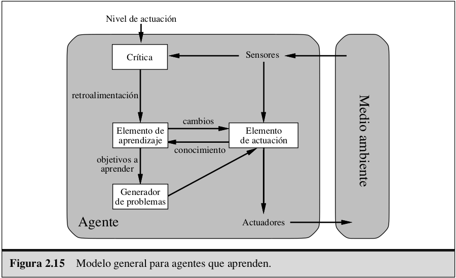

   Un agente que aprende es más eficiente y flexible que un agente simple, basado en objetivos o en utilidad, ya que este es capaz de modificarse a sí mismo de manera constante para que sus acciones máximisen su medida de rendimiento a corto, mediano y largo plazo, es capaz de plantear y experimentar nuevas situaciones que lo erriquezcan con información, que puede utilizar posteriormente para reforzar su conocimiento base. Este agente se adapta de una forma más facilmente a un medio cambiante, ya que constantemente se está modificando a sí mismo por medio de la retroalimentación.

   Los elementos que conforman este agente interactúan de la siguiente forma:

   El agente recibe percepciones del mundo con ayuda de los sensores, estos junto a los niveles de actuación, le permiten reconocer si las acciones que realiza lo acercan o alejan de su objetivo (este proceso se conoce como cŕitica), luego determina si debe evolucionar o mantener el equilibrio de su estado actual, utilizando esta retroalimentación para definir qué parte de sí mismo debe desarrollar o reforzar para obtener mejores resultados en un futuro y, finalmente, lleva a cabo las mejoras requeridas para actuar con una base de conocimiento más completa.

   Si el agente no posee suficiente información del resultado de sus acciones en sircunstacias y periodos de tiempo específicos, sugerirá escenarios de exploración para poder alcanzar ciertos objetivos de aprendizaje, lo que desencadenará nuevas percepciones y esto enrriquecerá su base de conocimientos, llegando así a reconocer cuando sus acciones lograrán obtener recompenzas a corto o largo plazo y cuando debe llevarlas a cabo.

4. Programa Picas y Fijas

# Introducción

La IA es una de las ciencias más recientes, el nombre se acuñó en 1956.

## ¿Qué es la IA?

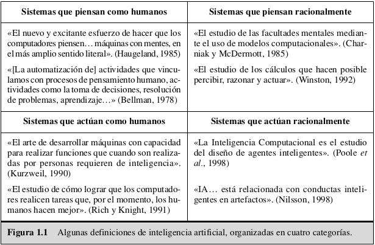

La parte superior, hace referencia a _procesos mentales_ y al _razonamiento_ y la
inferior aluden a la _conducta_.

- **Piensa como humanos:** No siempre son racionales
- **Piensa racionalmente:** Pensar lo correcto
- **Actúa como humanos:** No necesariamente de forma racional.
- **Actúa racionalmente:**

Hay un enfrentamiento entre estos enfoques. El que está centrado en el
comportamiento **humano** debe ser una ciencia empírica que incluya hipótesis y
confirmaciones mediante experimentos. El enfoque **racional** implica una
combinación de matemáticas e ingeniería.

### Comportamiento humano: el enfoque de la prueba de Turing.

Esta fue propuesta por Alan Turing (1950), se diseñó para proporcionar una
definición operacional y satisfactoria de inteligencia. La prueba se basa en la
incapacidad de diferenciar entre entidades inteligentes indiscutibles y seres
humanos. El computador debería poseer las siguientes capacidades:

- **Procesamiento de lenguaje natural**
- **Representación del conociemiento** para almacenar lo que se conoce o siente.
- **Razonamiento automático** para utilizar la información almacenada para
  responder a preguntas y extraer nuevas conclusiones.
- **Aprendizaje automático** para adaptarce a nuevas circunstancias y para
  detectar y extrapolar patrones.

La **Prueba global de Turing** inclye una señal de video que permite al evaluador
valorar la capacidad de percepción del evaluado, también la oportunidad de
intercambiar objetos físicos a través de una ventana. Para superar la prueba, el
computador debe estaar dotado de:

- **Visión computacional:** para percibir objetos
- **Robótica:** Manipular y mover objetos.

### Pensar como humano: el enfoque del modelo cognitivo

Para poder decir que un programa dado piensa como un humano, es necesario contar
con un mecanismo para determinar cómo piensan los humanos, hay dos formas de
hacerlo:

1. Introspección
2. Experimentos psicológicos

Una vez se cuente con una teoría lo suficientemente precisa sobre cómo trabaja la
mente, se podrá expresar esa teoría en la forma de un programa de computador. Si
los datos de entrada/salida del programa y los tiempos de reacción son similares a
los de un humano, existe la evidencia de que algunos de los mecanismos del
programa se pueden comparar con los que utilizan los seres humanos.

### Pensamiento Racional: el enfoque de las _leyes del pensamiento_

Aristóteles fue uno de los primeros en intentar codificar la «manera correcta de
pensar», es decir, un proceso de razonamiento irrefutable. Sus silogismos son
esquemas de estructuras de argumentación mediante las que siempre se llega a
conclusiones correctas si se parte de premisas correctas. Estas leyes de
pensamiento supuestamente gobiernan la manera de operar de la mente; su estudio
fue el inicio de un campo llamado lógica.

En 1965 existían programas que, en principio, resolvían cualquier problema
resoluble descrito en notación lógica. La llamada tradición **logista** dentro del
campo de la inteligencia artificial trata de construir sistemas inteligentes a
partir de estos programas.

Este enfoque presenta dos obstáculos:

1. No es fácil transformar conocimiento informal y expresarlo en los términos
   formales que requieren de notación lógica,
2. Hay una gran diferencia entre poder resolver un problema «en principio» y
   hacerlo en la práctica (demanda de recursos elevada)

### Actuar de forma racional: el enfoque del agente racional

Los agentes informáticos tienen otros atributos que los distinguen de los
_programas_ convencionales, como:

- Controles autónomos.
- Capacidad de percibir su entorno.
- Persistencia durante un tiempo prolongado.
- Adaptabilidad.
- Alcanzar objetivos diferentes.

Un **agente racional** es aquel que actúa con la intención de alcanzar el mejor
resultadoo, cuando hay incertidumbre, el mejor resultado esperado. Se comporta
tan bien como puede. Obtener una racionalidad perfecta (hacer siempre lo
correcto) no es posible en entornos complejos.

**Racionalidad limitada:** Actuar adecuadamente cuando no se cuenta con el
tiempo suficiente para efecturar todos los cálculos que serían deseables.

Una manera racional de actuar es llegar a la conclusión lógica de que si una
acción dada permite alcanzar un objetivo, hay que llevar a cabo dicha acción. Sin
embargo, el efectuar una inferencia correcta no depende siempre de la
racionalidad, ya que existen situaciones para las que no hay nada correcto que
hacer y en las que hay que tomar una decisión.

## Los fundamentos de la IA

### Filosofía

- ¿Se pueden utilizar reglas formales para extraer conclusiones válidas?

  Aristóteles (384-322 a.C.) fue el primero en formular un conjunto preciso de
  leyes que gobernaban la parte racional de la inteligencia. Él desarrolló un
  sistema informal para razonar adecuadamente con silogismos, que en principio
  permitía extraer conclusiones mecánicamente, a partir de premisas iniciales.

- ¿Cómo se genera la inteligencia mental a partir de un cerebro físico?
  Descartes (1596-1650) proporciona la primera discusión clara sobre la distinción
  entre la mente y la materia y los problemas que surgen.

  - **Dualismo:** Existe una parte de la mente (o del alma o del espiritu) que está
    al margen de la naturaleza, exenta de las influencias de las leyes físicas.
  - **Materialismo:** Las operaciones del cerebro realizadas de acuerdo a las leyes
    de la física constituyen la mente. El libre albedrío es simplemente la forma en
    la que la percepción de las opciones disponibles aparecen en el proceso de
    selección.

- ¿De dónde viene el conocimiento?

  - Movimiento **empírico:** Nada existe en la mente que no haya pasado antes por
    los sentidos
  - **Inducción:** las reglas generales se obtienen mediante la exposición a
    asociaciones repetidas entres sus elementos.
  - **Positivismo lógico:** Todo el conocimiento se puede caracterizar mediante
    teorías lógicas relacionadas, en última instancia, con sentencias de
    observación que corresponden a estímulos sensoriales
  - La **teoría de la confirmación:** El libro de Carnap, _The Logical Structure
    of the World_ (1928), define un procedimiento computacional explícito para la
    extracción de conocimiento a partir de experiencias primarias. Fue
    posiblemente la primera teoría en mostrar la mente como un proceso
    computacional.

- ¿Cómo se pasa del conocimiento a la acción?
  Aristóteles argumenta que las acciones se pueden justificar por la conexión
  lógica entre los objetivos y el conocimiento de los efectos de las acciones:

  _"Nosotros no reflexionamos sobre los fines, sino sobre los medios. Un médico no
  reflexiona sobre si debe curar, ni un orador sobre si debe persuadir... Ellos
  asumen el fin y consideran cómo y con qué medios se obtienen, y si resulta fácil
  y es por tanto productivo; mientras que si sólo se puede alcanzar por un medio
  se tiene en consideración cómo se alcanzará por este y por qué medios se
  obtendrá éste, hasta que se llegue a la causa primera..., y lo último en el
  orden del análisis parece ser lo primero en el orden de los acontecimientos. Y
  si se llega a un estado imposible, se abandona la búsqueda, como por ejemplo si
  se necesita dinero y no se puede conseguir; pero si hay una posibilidad se
  intentará."_

  El algoritmo de Aristóteles se implementó 2.300 años más tarde por Newell y
  Simon con la ayuda de su programa SRGP. El cual se conoce como sistema de
  planificación regresivo.

### Matemáticas

- ¿Qué reglas formales son las adecuadas para obtener conclusiones válidas? -
  lógica
- ¿Qué se puede computar? - intratabilidad

  Se dice que un problema es **intratable** si el tiempo necesario para la
  resolución de casos particulares de dicho problema crece exponencialmente con el
  tamaño de dichos casos. Por tanto, se debe optar por dividir el problema de la
  generación de una conducta inteligente en subproblemas que sean tratables en vez
  de manejar problemas intratables. **NP-completitud**.

- ¿Cómo razonamos con información incierta?

  La **probabilidad** se convirtió pronto en parte imprescindible de las ciencias
  cuantitativas, ayudando en el tratamiento de mediciones con incertidumbre y de
  teorías incompletas.

### Economía

- ¿Cómo se debe llevar a cabo el proceso de toma de decisiones para maximizar el
  rendimiento?

  Las economías pueden concebirse como un conjunto de agentes individuales que
  intentan maximizar su propio estado de bienestar económico. La **teoría de la
  decisión**, que combina la teoría de la probabilidad con la teoría de la
  utilidad, proporciona un marco completo y formal para la toma de decisiones
  (económicas o de otra índole) realizadas bajo incertidumbre.

- ¿Cómo se deben llevar a cabo acciones cuando otros no colaboren?

  Cuando se trata de «pequeñas» economías, la situación se asemeja más a la de un
  **juego:** las acciones de un jugador pueden afectar significativamente a la
  utilidad de otro. **Teoría de juegos**.

- ¿Cómo se deben llevar a cabo acciones cuando los resultados se obtienen en un futuro lejano?
  La gran mayoría de los economistas no se preocuparon de la tercera cuestión
  mencionada, se obtienen los resultados de las acciones de forma secuencial. El
  campo de la **investigación operativa** persigue este objetivo. El trabajo de
  Richard Bellman (1957) formaliza una clase de problemas de decisión secuencial
  llamados **procesos de decisión de Markov**.

# Agentes inteligentes

## Agentes y su entorno

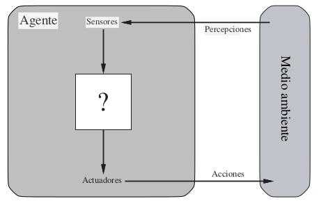

- **Agente:** es cualquier cosa capaz de percibir su **Medioambiente** con la
  ayuda de **sensores** y actuar en ese medio utilizando **actuadores**.
  Cada agente puede percibir sus propias acciones (pero no siempre sus efectos).
  El comportamiento de un agente viene dado por la **función agente**.
- **Percepción:** El agente puede recibir entradas en cualquier instante.
- **Secuencia de percepciones:** refleja el historial completo de lo que el
  agente ha recibido. _Un agente tomará una desición en un momento dado
  dependiendo de la secuencia completa de percepciones hasta ese instante_.
- **Función agente:** Proyecta una percepción dada, en una acción. Se
  implementará mediante el **programa del agente**. La función del agente es una
  descripción matemática abstracta; el programa del agente es una implementación
  completa, que se ejecuta sobre la arquitectura del agente.

## Buen comportamiento: el concepto de racionalidad

Un agente racional es aquel que hace lo correcto. Hacer lo correcto es aquello
que permite al agente obtener un resultado mejor. Por lo tanto, se necesita
determinar una forma de medir el éxito. Ello, junto a la descripción del entorno
y de los sensores y actuadores del agente, proporcionará una especificación
completa de la tarea que desempeña el agente.

### Medidas de rendimiento

Incluyen los criterios que determinan el éxito en el comportameinto del agente.
Cuando se sitúa un agente en un medio, éste genera una secuencia de acciones de
acuerdo con las percepciones recibidas. Si la secuencia es la deseada, entonces
el agente habrá actuado correctamente.

_Como regla general, es mejor diseñar medidas de utilidad de acuerdo con lo que
se quiere para el entorno, más que de acuerdo con cómo se cree que el agente
debe comportarse_.

### Racionalidad

Depende de 4 factores:

- La medida de rendimiento que define el criterio de éxito.
- El conocimiento del medio en el que habita, acumulado por el agente.
- Las acciones que el agente puede llevar a cabo.
- La secuencia de percepciones del agente hasta este momento.

_En cada posible secuencia de percepciones, un agente racional deberá emprender
aquella acción que supuestamente maximice su medida de rendimiento, basándose en
las evidencias aportadas por la secuencia de percepciones y en el conocimiento
que el agente mantiene almacenado_

### Omnisciencia, aprendizaje y autonomía

Un agente omnisciente conoce el resultado de su acción y actúa de acuerdo con
él; sin embargo, en realidad la omnisciencia no es posible. La **recopilación de
información** busca llevar a cabo acciones con la intención de modificar las
percepciones futuras. No es suficiente con recopilar la información, el agente
debe **aprender** lo máximo porsible de lo que está percibiendo.
Se dice que un agente carece de **autonomía** cuando se apoya más en el
conocimiento inicial que le proporciona su diseñador que en sus propias
percepciones. Un agente racional debe ser autónomo, debe saber aprender a
determinar cómo tiene que compensar el conocimiento incompleto o parcial inicial

## Agente Racional

Entidad que percibe algo y actúa. Un agente racional es aquel que hace lo correcto
a partir de lo que conocen y perciben.

$$
F: P^* \rightarrow A
$$

- $P:$ Percepción.
- $P^*:$ Todo lo que ha percibido desde que ha existido.
- $A:$ Acción que devuelve el agente, maximisa o minimisa una medida de
  rendimiento.

Dado que no se tiene infinita capacidad de cálculo, memoria ni tiempo, hacer un
agente perfectamente racional, es imposible para todo problema (en general).

## La naturaleza del entorno

Son esencialmente los **problemas** para los que los agentes racionales son las
**soluciones**.

### Especificación del entorno de trabajo

**REAS** (**R**endimiento, **E**ntorno, **A**ctuadores, **S**ensores).

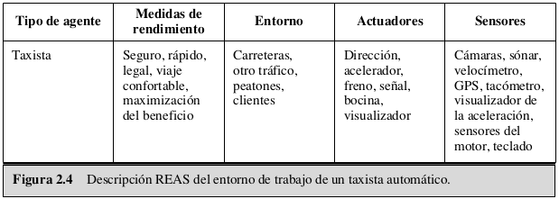
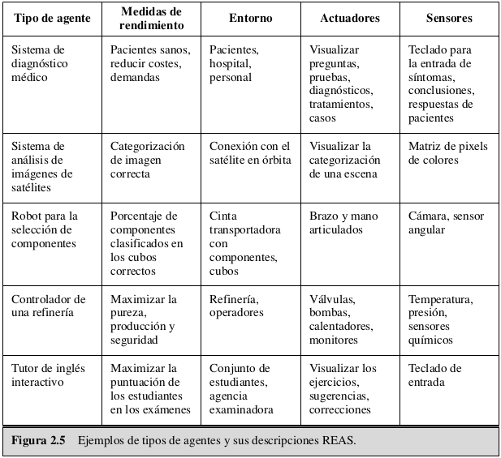

#### Propiedades de los entornos de trabajo

Estas dimensiones determinan, hasta cierto punto, el diseño más adecuado para el
agente y la utilización de cada una de las familias principales de técnicas en
la implementación del agente.

- **Totalmente observable** vs. **Parcialmente observable**

Si los sensores del agente le proporcionan acceso al estado completo del medio
en cada momento, entonces se dice que el entorno de trabajo es totalmente
observable. Estos son convenientes ya que el agente no necesita mantener ningún
estado interno para saber qué sucede en el mundo. Un entorno puede ser
parcialmente observable debido al ruido, por sensores poco exactos o porque los
sensores no reciben información de parte del sistema.

- **Determinista** vs. **Estocástico**

Si el siguiente estado del medio está totalmente determinado por el estado
actual y la acción ejecutada por el agente, entonces se dice que el entorno
es determinista; de otra forma es estocástico. Si el medio es parcialmente
observable entonces puede _parecer_ estocástico. Es mejor pensar en entornos
deterministas o estocásticos _desde el punto de vista del agente_.
Si el medio es deterinista, excepto para las acciones de otros agentes, decimos
que el medio es **estratégico**.

- **Episódico** vs. **Secuencial**

En un entorno de trabajo episódico, la experiencia del agente se divide en
episodios atómicos. Cada episodio consiste en la percepción del agente y la
realización de una única acción posterior. El siguiente episodio **no** depende
de las acciones en episiodios previos. Este es más fácil ya que el agente no
necesita pensar con tiempo.

En entornos secuenciales, la decisión presente puede afectar a decisiones
futuras.

- **Estático** vs. **Dinámico**

Si el entorno puede cambiar cuando el agente está deliberando, entonces se dice
que el entorno es dinámico para el agente; de otra forma se dice que es
estático. Si el entorno no cambia con el paso del tiempo, pero el rendimiento
del agente cambia, se dice que el medio es **semidinámico**.

- **Discreto** vs. **Continuo**

La distinción entre discreto y continuo se puede aplicar al estado del medio,
a la forma en la que se maneja el tiempo y a las percepciones y acciones del
agente. Por ejemplo, un medio con estados discretos como el del juego del
ajedrez tiene un número finito de estados distintos.

- **Agente individual** vs. **Multiagente**

Se ha descrito que una entidad puede percibirse como un agente, pero no se ha
explicado qué entidades se deben considerar agentes. ¿Tiene el agente A (por
ejemplo el agente taxista) que tratar un objeto B (otro vehículo) como un
agente, o puede tratarse méramente como un objeto con un comportamiento
estocástico? La distinción clave está en identificar si el comportamiento de B
está mejor descrito por la maximización de una medida de rendimiento cuyo valor
depende del comportamiento de A.

Por ejemplo, en el ajedrez, la entidad oponente B intenta maximizar su medida de
rendimiento, la cual, según las reglas, minimiza la medida de rendimiento del
agente A. Por tanto, el ajedrez es un entorno multiagente **competitivo**.
Por otro lado, en el medio definido por el taxista circulando, el evitar
colisiones maximiza la medida de rendimiento de todos los agentes, así pues es
un entorno multiagente parcialmente **cooperativo**.

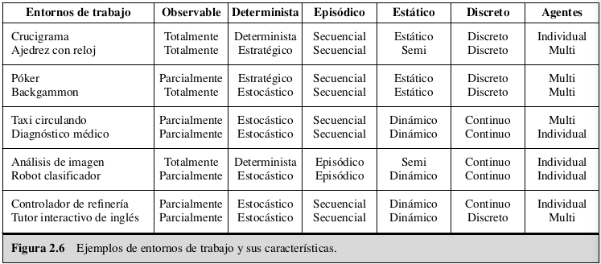

## Estructuras de los agentes

El trabajo de la IA es diseñar el **programa del agente** que implemente la
función del agente que proyecta las percepciones en las acciones. Se asume que
este programa se ejecutará en algún tipo de computador con sensores físicos y
actuadores, lo que se conoce como **arquitectura**.

$$
Arquitectura = sensores + actuadores + \textup{\textit{máquina dónde se ejecuta el
programa agente}}\\
Agente = arquitectura + programa
$$

La arquitectura y el programa deben ser compatibles. Si el programa tiene
recomendaciones como _Caminar_, la arquitectura tiene que tener piernas.

### Programas de los agentes

Hay que tener en cuenta la diferencia entre los programas de los agentes, que
toman la percepción actual como entrada, y la función agente, que recibe la
percepción histórica completa.

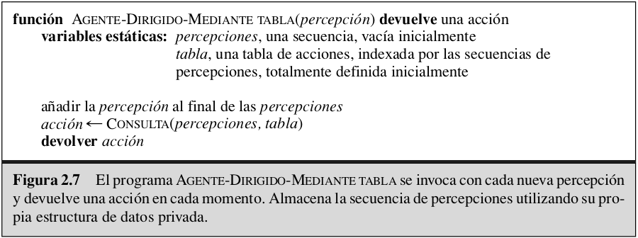

El programa de agente dirigido mediante tabla está condenado al fracaso, ya que
este tendrá que tener una tabla de búsqueda muy grande para devolver una acción
dadas las percepciones recibidas:

- $P:$ Conjunto de posibles percepciones.
- $T:$ Tiempo de vida del agente
- Entradas de la tabla = $\sum_{t=1}^{T}{|P|}^t$

#### **Agentes reactivos simples**

Estos agentes seleccionan las acciones sobre la base de las percepciones actuales,
ignorando el resto de las percepciones históricas.

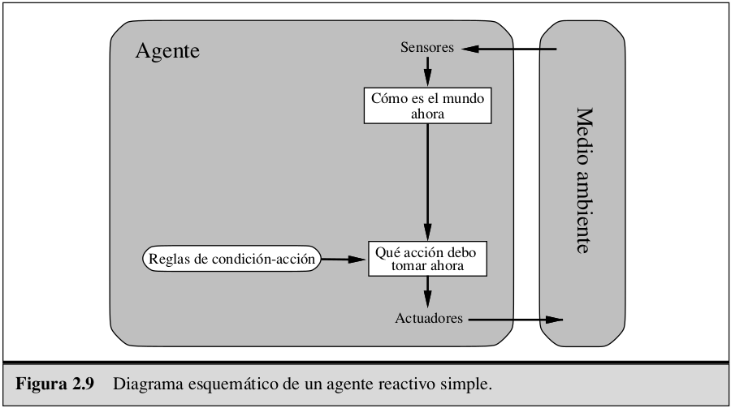

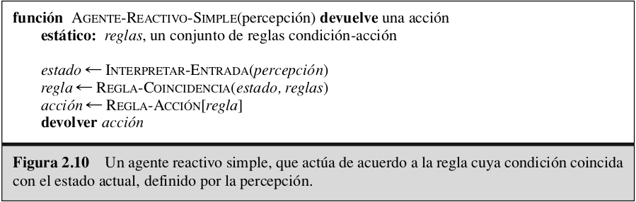

El agente sólo funcionará si se puede tomar la decisión correcta sobre la base de
la percepción actual, lo cual es posible sólo si el entorno es totalmente
observable. Un agente reactivo simple con capacidad para elegir acciones de manera
aleatoria puede mejorar los resultados que proporciona un agente reactivo simple
determinista (está sujeto a caer en bucles infinitos).

#### **Agentes reactivos basados en modelos**

El agente debe mantener algún tipo de **estado interno** que dependa de la
historia percibida y que de ese modo refleje por lo menos alguno de los aspectos
no observables del estado actual.

La actualización de la información de estado interno según pasa el tiempo requiere
codificar dos tipos de conocimiento en el programa del agente:

1. Se necesita alguna información acerca de cómo evoluciona el mundo
   independientemente del agente.
2. Se necesita más información sobre cómo afectan al mundo las acciones del agente

Este conocimiento acerca de <<cómo funciona el mundo>>, se denomina modelo.

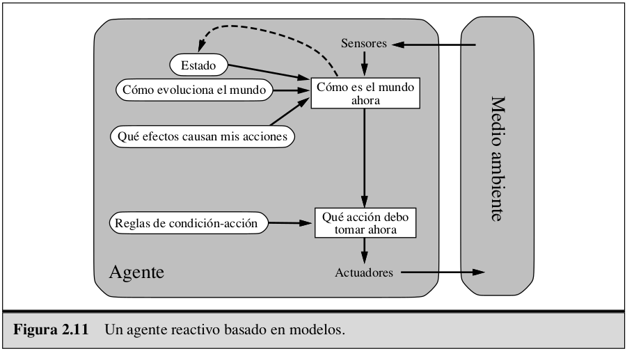

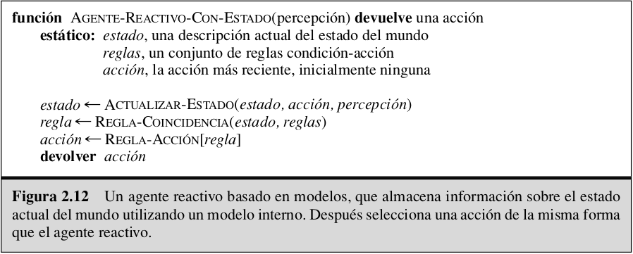

#### **Agentes basados en objetivos**

Además de la descripción del estado actual, el agente necesita algún tipo de
información sobre su **meta** que describa las situaciones que son deseables.

El programa del agente se puede combinar con información sobre los resultados
de las acciones posibles, para elegir aquellas que le permitan alcanzar su
objetivo.

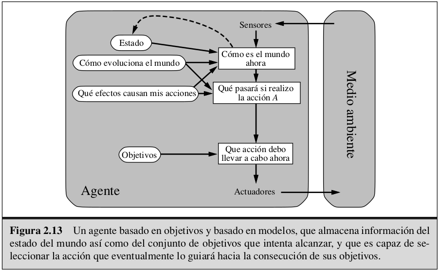

La selección de acciones basadas en objetivos es directa, cuando alcanzar los
objetivos es el resultado inmediato de una acción individual. En otras ocaciones
puede ser más complicado, cuando debe conciderar secuencias complejas para alcanzar
su objetivo. La **Búsqueda** y la **planificación** son los subcampos de la IA
centrados en encontrar secuencias de acciones que permitan a los agentes alcanzar
sus metas.

Aunque el agente basado en objetivos pueda parecer menos eficiente, es más
flexible ya que el conocimiento que soporta su decisión está representado
explícitamente y puede modificarse. El comportamiento del agente basado en
objetivos puede cambiarse fácilmente, un agente reactivo requeriría modificaciones
mayores.

#### **Agentes basados en utilidad**

Las metas sólo proporcionan una cruda distinción binaria entre los estados de
«felicidad» y «tristeza», mientras que una medida de eficiencia más general
debería permitir una comparación entre estados del mundo diferentes de acuerdo al
nivel exacto de felicidad que el agente alcance cuando se llegue a un estado u
otro. Un estado del mundo tienen diferentes grados de **utilidad** para el agente.

Una **función de utilidad** proyecta un estado (o secuencia de estados) en un
número real, que representa el nivel de felicidad, esta permite tomar desiciones
racionales en dos tipos de casos:

1. Cuando haya **objetivos conflictivos** y sólo se pueda alcanzar alguno de ellos.
2. Cuando haya **varios objetivos** por los que se pueda guiar el agente, y
   **ninguno de ellos se pueda alcanzar con certeza**, la utilidad proporciona un
   mecanismo para ponderar la probabilidad de éxito en función de la importancia
   de los objetivos.

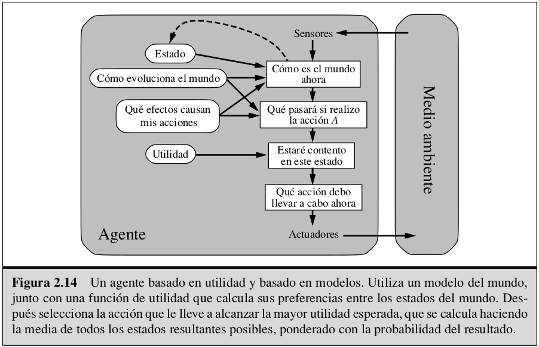

#### **Agentes que aprenden**

El aprendizaje permite que el agente opere en medios inicialmente desconocidos y
que sea más competente que si sólo utilizase su conocimiento inicial. El
aprendizaje está por fuera de la inteligencia, es una cualidad más compleja


- **Elemento de aprendizaje:** Es el responsable de hacer mejoras. Se
  retroalimenta con las cŕiticas sobre la actuación del agente y determina cómo se
  debe modificar el elemento de actuación para proporcionar mejores resultados.
- **Elemento de actuación:** Es responsable de seleccionar acciones externas. Es
  lo que anteriormente se concideraba como agente completo (recibe estímulos y
  determina qué acción realizar)
- **Crítica:** Indica al elemento de aprendizaje qué tal lo está haciendo el
  agente con respecto a un nivel de actuación fijo. Es necesaria porque las
  percepciones por sí mismas no prevén una indicación del éxito del agente.
- **Generador de problemas:** Es responsable de sugerir acciones nuevas que lo
  guiarán hacia experiencias nuevas e informativas. Si el agente está dispuesto a
  explorar un poco, y llevar a cabo acciones que no sean totalmente óptimas a
  corto plazo, puede descubrir acciones mejores a largo plazo.
- _Nivel de actuación:_ Conceptualmente se debe tratar como si estuviese fuera del
  agente, ya que este no debe modificarlo para su propio interés. Identifica parte
  de las percepciones entrantes como **recompensas** o **penalizaciones**.

Cuando se intenta diseñar un agente que tenga capacidad de aprender, la primera
cuestión a solucionar no es ¿cómo se puede enseñar a aprender?, sino ¿qué tipo de
elemento de actuación necesita el agente para llevar a cabo su objetivo, cuando
haya aprendido cómo hacerlo? Dado un diseño para un agente, se pueden construir
los mecanismos de aprendizaje necesarios para mejorar cada una de las partes del
agente.

El aprendizaje en el campo de los agentes inteligentes puede definirse como el
proceso de modificación de cada componente del agente, lo cual permite a cada
componente comportarse más en consonancia con la información que se recibe, lo que
por tanto permite mejorar el nivel medio de actuación del agente.

# Resolver problemas mediante búsqueda

_Cómo un agente puede encontrar una secuencia de acciones que alcance sus
objetivos, cuando ninguna acción simple lo hará._

Los agentes basados en objetivos pueden tener éxito considerando las acciones
futuras y lo deseable de sus resultados. Los agentes resolventes-problemas deciden
qué hacer para encontrar secuencias de acciones que conduzcan a los estados
eseables.

Algoritmos de propósito general para resolver estos problemas:

- **No informados:** No dan información sobre el problema, salvo su definición.
- **Informados:** Tienen cierta idea de dónde buscar las soluciones.

## Agentes resolvente-problemas

Los objetivos ayudan a organizar su comportamiento, limitando las metas que
intenta alcanzar el agente. El primer paso para solucionar un problema es la
**formulación del objetivo** (conjunto de estados que satisfacen el objetivo),
basado en la situación actual y la medida de rendimiento del agente.

Dado un objetivo, la **formulación del problema** es el proceso de decidir qué
acciones y estados tenemos que considerar.

_Un agente con distintas opciones inmediatas de valores desconocidos puede
decidir qué hacer, examinando las diferentes secuencias posibles de acciones que
le conduzcan a estados de valores conocidos, y entonces escoger la mejor secuencia_


Este proceso de hallar esta secuencia se llama **búsqueda**. Un algoritmo de
búsqueda toma como entrada un problema y devuelve una solución de la forma
secuencia de acciones. Luego se procede a ejecutar las acciones que ésta
recomienda. Esta es la llamada fase de **ejecución**. Una vez ejecutada la
solución, el agente formula un nuevo objetivo.

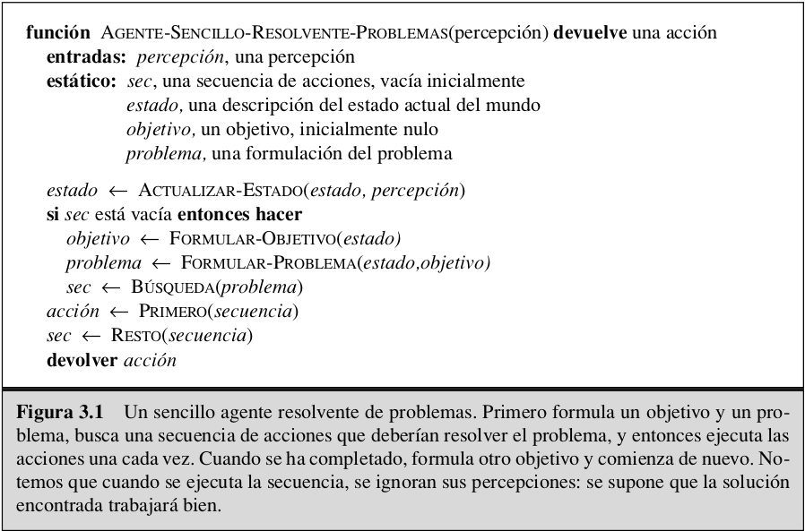

Los agentes que realizan sus planes con los ojos cerrados, por así decirlo, deben
estar absolutamente seguros de lo que pasa (los teóricos de control lo llaman
sistema de **lazo abierto**, porque ignorar las percepciones rompe el lazo entre
el agente y el entorno).

### Problemas y soluciones bien definidos

Un problema puede definirse, formalmente, por cuatro componentes:
- **Estado inicial:** Dónde comienza el agente.
- **Función sucesor:** Una descripción de las posibles acciones disponibles por el
  agente. La formulación 3 más común utiliza una función sucesor. Dado un estado
  particular $x$, $SUCESOR-FN(x)$ devuelve un conjunto de pares ordenados $<acción, sucesor>$.
  Implícitamente el estado inicial y la función sucesor definen el **espacio de
  estados** del problema (el conjunto de todos los estados alcanzables desde el
  estado inicial). El espacio de estados forma un grafo en el cual los nodos son
  estados y los arcos entre los nodos son acciones. Un **camino** en el espacio de
  estados es una secuencia de estados conectados por una secuencia
  de acciones.
- **Test objetivo:** Determina si un estado es un estado objetivo.
- Una función **costo del camino** que asigna un costo numérico a cada camino.
  El **costo individual** de una acción $a$ que va desde un estado $x$ al estado
  $y$ se denota por $c(x,a,y)$.

Una **solución** de un problema es un camino desde el estado inicial a un estado
objetivo. La calidad de la solución se mide por la función costo del camino, y una
**solución óptima** tiene el costo más pequeño del camino entre todas las
soluciones.

### Formular los problemas

Al proceso de eliminar detalles de una representación se le llama **abstracción**.
La abstracción es válida si podemos ampliar cualquier solución abstracta a una
solución en el mundo más detallado, y es útil si al realizar cada una de las
acciones en la solución es más fácil que en el problema original.

## Ejemplos de Problemas

Diferencias entre _problemas de juguete_ y _problemas del mundo real_:
- Un **problema de juguete** se utiliza para ilustrar o ejercitar los métodos de
  resolución de problemas. Éstos se pueden describir de forma exacta y concisa.
- Un **problema del mundo-real** es aquel en el que la gente se preocupa por sus
  soluciones.

### Problemas de juguete

Problema de la Aspiradora:

- **Estados:** el agente está en una de dos localizaciones, cada una de las cuales
  puede o no contener suciedad. Así, hay $2 \cdot 2^2 = 8$ posibles estados del mundo.
- **Estado inicial:** cualquier estado puede designarse como un estado inicial.
- **Función sucesor:** ésta genera los estados legales que resultan al intentar
  las tresacciones (Izquierda, Derecha y Aspirar). En la Figura 3.3 se muestra el
  espacio de estados completo.
- **Test objetivo:** comprueba si todos los cuadrados están limpios.
- **Costo del camino:** cada costo individual es 1, así que el costo del camino es
  el número de pasos que lo compone.

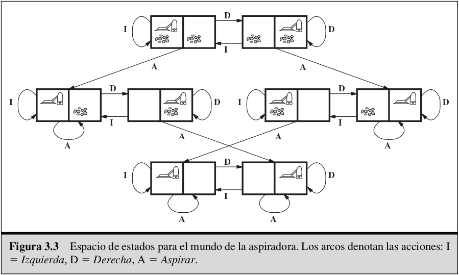

### Problemas del Mundo Real

El **problema de búsqueda de una ruta** está definido en términos de posiciones y
transiciones a lo largo de ellas:

- **Estados:** cada estado está representado por una localización (por ejemplo, un
  aeropuerto) y la hora actual.
- **Estado inicial:** especificado por el problema.
- **Función sucesor:** devuelve los estados que resultan de tomar cualquier vuelo
  programado (quizá más especificado por la clase de asiento y su posición) desde
  el aeropuerto actual a otro, que salgan a la hora actual más el tiempo de
  tránsito del aeropuerto.
- **Test objetivo:** ¿tenemos nuestro destino para una cierta hora especificada?
- **Costo del camino:** esto depende del costo en dinero, tiempo de espera, tiempo
  del vuelo, costumbres y procedimientos de la inmigración, calidad del asiento,
  hora, tipo de avión, kilometraje del aviador experto, etcétera.

El **problema del viajante de comercio (PVC)** es un problema de ruta en la que
cada ciudad es visitada exactamente una vez. La tarea principal es encontrar el
viaje más corto. El problema es de tipo NP duro.

Los **problemas turísticos** están estrechamente relacionados con los problemas de
búsqueda de una ruta, pero con una importante diferencia: cada estado debe incluir
no sólo la localización actual sino también las ciudades que el agente ha visitado.

## Búsqueda de Soluciones

Este capítulo se ocupa de las técnicas de búsqueda que utilizan un **árbol de
búsqueda** explícito generado por el estado inicial y la función sucesor,
definiendo así el espacio de estados. La raíz del árbol de búsqueda es el **nodo de
búsqueda** que corresponde al estado inicial. Como no estamos en un estado
objetivo, tenemos que considerar otros estados, esto se hace **expandiendo** el
estado actual; es decir aplicando la función sucesor al estado actual y generar
así un nuevo conjunto de estados. El estado a expandir está determinado por la
**estrategia de búsqueda**.

Un nodo es una estructura de datos con cinco componentes:
- **Estado:** el estado, del espacio de estados, que corresponde con el nodo.
- **Nodo padre:** El nodo en el árbol de búsqueda que ha generado este nodo.
- **Acción:** La acción que se aplicará al padre para generar el nodo.
- **Costo del camino:** Tradicionalmente denotado por $g(n)$, de un camino desde
  el estado inicial al nodo, indicado por los punteros a los padres.
- **Profundidad:** El número de pasos a los largo del camino desde el estado
  inicial.

La conexión de nodos que se han generado pero no expandido, se conoce como **frontera**, cada elemento de la frontera es un nodo hoja, no se ha expandido.

Las operaciones en una **Cola** son:
- `createQueue(element)`: Crea una cola con los elementos dados.
- `isEmpty(queue)`: Devuelve Verdadero si no hay ningún elemento en la cola
- `first(queue)`: Devuelve el primer elemento de la cola.
- `deleteFirst(queue)`: Devuelve `first(queue)` y lo borra de la cola.
- `insert(element, queue)`: Inserta elemento en la cola y devuelve la cola
  resultado
- `insertAll(elements, queue)`: Inserta un conjunto de elemenntos en la cola y
  devuelve la cola resultado.

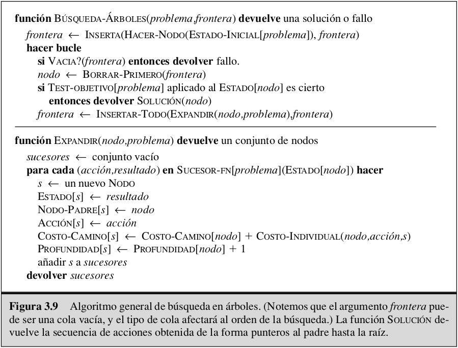

## Medir el rendimiento de la resolución del problema

Evaluaremos el rendimiento de un algoritmo de cuatro formas:
- **Completitud:** ¿Está garantizado que el algoritmo encuentre una solución cuando
  esta exista?
- **Optimización:** ¿Encuentra la solución óptima?
- **Complejidad en tiempo:** ¿Cuánto tarda en encontrar una solución?
- **Complejidad en espacio:** ¿Cuánta memoria se necesita para el funcionamiento de
  la búsqueda?

La **complejidad** se expresa en terminos de 3 cantidades:
- **b:** Factor de ramificación, es el máximo de sucesores de
  cualquier nodo.
- **d:**  La profundidad el nodo objetivo más superficial.
- **m:** La longitud máxima de cualquier camino en el espacio de estados.

Para valorar la eficacia de un algoritmo de búsqueda, podemos considerar el
**costo de la búsqueda** (que depende típicamente de la complejidad en tiempo pero
puede incluir también un término para el uso de la memoria) o podemos utilizar el
**coste total**, que combina el costo de la búsqueda y el costo del camino
solución encontrado.

## Estrategias de búsqueda no informada

El nombre de **busqueda no informada** hace referencia a que ellas no tienen
información adicional acerca de los estados más allá de la que proporciona la
definición del problema. Todo lo que ellas pueden hacer es generar los sucesores y
distinguir entre un estado objetivo de uno que no lo es.

### Búsqueda primero en Anchura

Se expande primero el nodo raíz, a continuación se expanden todos los sucesores
del nodo raíz, después sus sucesores, etc. En general, se expanden todos los nodos
a una profundidad en el árbol de búsqueda antes de expandir cualquier nodo del
próximo nivel.

la `SEARCH-TREE(problem,QUEUE-FIFO())` resulta una búsqueda primero en anchura. La
cola FIFO pone todos los nuevos sucesores generados al final de la cola, lo que
significa que los nodos más superficiales se expanden antes que los nodos más
profundos.

El nodo objetivo más superficial no es necesariamente el óptimo. La búsqueda
primero en anchura es óptima si el costo del camino es una función no decreciente
de la profundidad del nodo (por ejemplo, cuando todas las acciones tienen el mismo
coste).

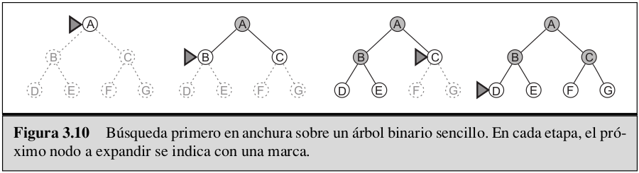

**Importante:**
- Son un problema más grande los requisitos de memoria para la búsqueda primero en 
  anchura que el tiempo de ejecución.
- Los problemas de búsqueda de complejidad exponencial no pueden resolverse por 
  métodos sin información, salvo casos pequeños.

### Búsqueda de costo uniforme

